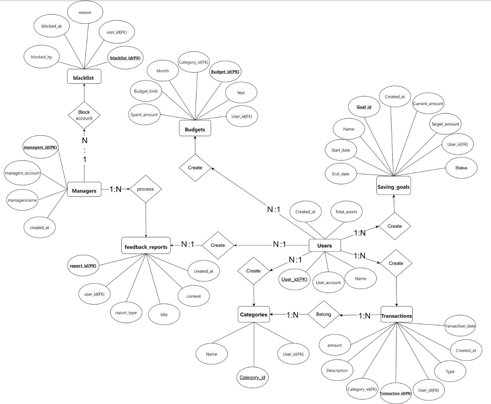

## 題目：記帳管理系統
此專題利用Amazon RDS建立一個雲端資料庫，可以供不同使用者註冊帳號享有自己的雲端記帳系統，可以記錄自己的總資產並會隨著新增的收入支出去改變資產數，也可以對自己的交易去新增不同的類別，像是飲食、交通、公司開銷、旅遊等可以依照使用者需求去自訂。紀錄交易時系統會依照使用者選擇的是收入或支出去做不同的行為，例如這筆交易是收入，就將此交易的金額加入總資產，讓總資產可以隨著交易的紀錄靈活變動。用戶還能建立自己每個月的預算金額是多少，例如在2025年的1月在飲食上的預算是多少錢，系統也會記錄目前已經花了多少錢。除了上述功能，還能新增儲蓄目標讓使用者自行設定不同目標，像是筆電需要多少錢、從什麼時候開始、何時結束，系統會顯示目前已經儲蓄的金額跟該目標是否已經完成。
## 報告
[期末簡報](https://www.canva.com/design/DAGooXezDFk/JuXnvlgG4OU5B8fCzmdRAA/view?utm_content=DAGooXezDFk&utm_campaign=designshare&utm_medium=link2&utm_source=uniquelinks&utlId=h7660f80551)

[📥 點我下載報告](https://github.com/joshu0601/Database-G04/raw/main/report/資料庫期末報告.docx)

## 應用情境
1. 每月薪水規劃:
使用者每月領薪水後，將薪資輸入系統，設定儲蓄目標與每月各類支出上限，（例如：飲食 $6000，交通 $2000）。

2. 日常消費紀錄:
每花一筆錢，快速打開 App 記錄，可以透過標籤或分類，（如：飲食、交通、娛樂）整理資料。

3. 支出統計與趨勢分析:
自動生成月報表或週報表，顯示：每類支出金額、哪一天花最多錢、哪些分類超出預算。

5. 存錢挑戰與目標追蹤:
設定短期/中期儲蓄目標，（例如：三個月存$15000），系統追蹤進度，提醒用戶節制支出。

| 使用者        | 使用案例說明                                                             |    
|--------------|-------------------------------------------------------------------------|
| 學生         |平時紀錄一些生活花費(早餐、午餐、晚餐)，或者依些娛樂的費用。|
| 上班族       |清楚記錄每月的工資收入，以及平時的一些生活花費，也能規劃屬於自己的儲蓄目標。|
| 會計師       |紀錄平時公司的收支情況，也能在最後統整時將整體收支畫成圖表供老闆看。|

## 系統需求說明
| 系統功能          | 功能說明                        |
|------------------|-------------------------------|
| 註冊登入       |每位使用者都可以註冊一個自己的帳號，自己管理自己帳號內的金錢|
| 日常消費紀錄   |使用這可以記錄自己日常的花費，例如吃飯、娛樂...等費用|
| 存錢挑戰與目標追蹤 |使用者可以為自己設立一個存錢的目標，且系統會跟你說目前離你的目標還差多遠|    

## 使用案例範例
| 使用情境           | 角色介紹                 | 案例描述                                                                 |
|--------------------|-----------------------------------|--------------------------------------------------------------------------|
| 每月薪水規劃       | 小宋，27 歲上班族      | 每月薪資 $35,000，設定飲食 $6000、交通 $2500 等預算，並目標每月存 $8000。系統會提醒她哪些項目快要超支。 |
| 日常消費紀錄       | 老高，21 歲大學生         | 每次花費後透過分類（如飲食、交通）快速記帳，使用「#朋友聚餐」等標籤補充內容。                       |
| 存錢挑戰與目標追蹤 | 小郭，23 歲社會新鮮人     | 設定三個月內存 $15,000 的旅費，系統每週追蹤儲蓄進度，未達標時發出提醒並給予鼓勵。                   |
| 支出統計與趨勢分析 | 張三，30 歲公司會計師    | 系統自動生成圖表顯示支出比例，幫助他跟老闆報告目前公司的收支情形。                               |

## 資料表

### 📋 managers 管理員資料表

| 欄位名稱          | 資料型別  | 限制條件                       | 說明       |
|------------------|-----------|-------------------------------|------------|
| managers_id      | INTEGER   | PRIMARY KEY                     | 管理員 ID  |
| managers_account | CHAR(255) | UNIQUE,NOT NULL            | 管理員帳號 |
| managersname     | CHAR(50)  | NOT NULL                   | 姓名       |
| created_at       | TIMESTAMP | DEFAULT CURRENT_TIMESTAMP     | 建立時間   |

密碼存在另外的資料庫。

### 📋 managers 管理員資料表

| 欄位名稱      | 限制條件                                                                                  |
|--------------|-------------------------------------------------------------------------------------------|
| managers_id      | 系統會依照管理員建立順序去對每個管理員給一個整數當作ID，該整數是從1開始的，每多一個管理員就+1 |
| managers_account | [1]                                                                                   |
| managersname     | 名稱只能是英文字母大小寫Aa到Zz、中文字，但不能有其他外文或特殊符號存在，長度最多為50         |
| created_at       | 建立時間格式為 yyyy-mm-dd，系統會設定使用者建立當下的時間為預設值                          |
---
[1]格式為 local-part@domain。local-part 僅能包含英文字母 a–z、A–Z、數字 0–9、特殊符號 !#$%&'*+-/=?^_`{|}~ 和 `.`，但點號不可作為開頭、結尾，亦不可連續出現，系統不接受 `"..."@domain` 的引號格式。<br>domain 為以點分隔的字串，每段最多 63 字元，總長不超過 255 字元，只能包含英數與 `-`（不可作為開頭或結尾），系統亦不接受 (test) 注釋形式。
### 📋 managers 管理員資料表 SQL
```sql
CREATE TABLE managers (
    managers_id INT AUTO_INCREMENT PRIMARY KEY,
    managers_account CHAR(255) UNIQUE NOT NULL,
    managersname CHAR(50) NOT NULL,
    created_at TIMESTAMP DEFAULT CURRENT_TIMESTAMP
);
```
---

### 📋 users 使用者資料表

| 欄位名稱      | 資料型別  | 限制條件                      | 說明       |
|--------------|-----------|-------------------------------|------------|
| user_id      | INTEGER | PRIMARY KEY                   | 使用者 ID  |
| user_account | CHAR(255) | UNIQUE,NOT NULL            | 使用者帳號 |
| name         | CHAR(50)  | NOT NULL                      | 姓名    |
| total_assets | INTEGER   |DEFAULT 0 CHECK (total_assets >= 0)| 總資產|
| created_at   | TIMESTAMP | DEFAULT CURRENT_TIMESTAMP     | 建立時間   |

密碼存在另外的資料庫。

### 📋 users 限制條件

| 欄位名稱      | 限制條件                                                                              |
|--------------|---------------------------------------------------------------------------------------|
| user_id      | 系統會依照使用者建立順序去對每個使用者給一個整數當作ID，該整數是從1開始的，每多一個使用者就+1 |
| user_account  | [1] |
| name         | 名稱只能是英文字母大小寫Aa到Zz、中文字，但不能有其他外文或特殊符號存在，長度最多為50|
| total_assets | 總資產只能是數字0~9組成，不能有除數字以外或特殊符號，且必須大於0|
| created_at   | 建立時間格式為 yyyy-mm-dd，系統會設定使用者建立當下的時間為預設值|
---
[1]格式為 local-part@domain。local-part 僅能包含英文字母 a–z、A–Z、數字 0–9、特殊符號 !#$%&'*+-/=?^_`{|}~ 和 `.`，但點號不可作為開頭、結尾，亦不可連續出現，系統不接受 `"..."@domain` 的引號格式。<br>domain 為以點分隔的字串，每段最多 63 字元，總長不超過 255 字元，只能包含英數與 `-`（不可作為開頭或結尾），系統亦不接受 (test) 注釋形式。
### 📋 users 使用者資料表SQL
```sql
CREATE TABLE users (
    user_id INT AUTO_INCREMENT PRIMARY KEY,
    user_account CHAR(255) NOT NULL UNIQUE,
    name CHAR(50) NOT NULL,
    total_assets INT DEFAULT 0 CHECK (total_assets >= 0),
    created_at TIMESTAMP DEFAULT CURRENT_TIMESTAMP
);
```
### 📋 users 使用者資料表SQL範例
```sql
INSERT INTO users (user_account, user_password, name, total_assets) VALUES
('xiaosong', 'abc123', '小宋', 350000),
('laogao', 'def456', '老高', 80000),
('xiaoguo', 'ghi789', '小郭', 28000),
('zhangsan', 'jkl000', '張三', 60000);
```
---
### 📋 categories 交易分類表

| 欄位名稱   | 資料型別 | 限制條件                                | 說明         |
|------------|----------|-----------------------------------------|--------------|
| category_id| INTEGER  | PRIMARY KEY                             | 分類 ID      |
| user_id    | INTEGER  | FOREIGN KEY → users(user_id)            | 使用者 ID    |
| name       | CHAR(50) | NOT NULL, UNIQUE(user_id, name)      | 分類名稱     |

### 📋 categories 完整性限制

| 欄位名稱   | 完整性限制                                                        |
|------------|----------------------------------------------------------------|
| category_id|  系統會根據使用者建立的類別去照順序編號，編號是從1開始的整數，只要分類建立就會+1|
| user_id    |   是users資料表中的ID，由數字1開始每次+1的編號  |
| name       | 分類的名稱可以是中文字、英文字，不能有特殊符號與數字   |

### 📋 categories 交易分類表SQL
```sql
CREATE TABLE categories (
    category_id INT AUTO_INCREMENT PRIMARY KEY,
    user_id INT,
    name CHAR(50) NOT NULL,
    UNIQUE (user_id, name),
    FOREIGN KEY (user_id) REFERENCES users(user_id)
);
```
### 📋 categories 交易分類表SQL範例
```sql
INSERT INTO categories (user_id, name) VALUES
(1, '飲食'), (1, '交通'),
(2, '飲食'), (2, '娛樂'),
(3, '旅遊'), (3, '飲料'),
(4, '業務開銷'), (4, '報帳用餐');
```
---

### 📋 transactions 交易紀錄表

| 欄位名稱     | 資料型別 | 限制條件                                  | 說明           |
|--------------|----------|-------------------------------------------|----------------|
| transaction_id   | INTEGER   | PRIMARY KEY                   | 交易 ID|
| user_id      | INTEGER  | FOREIGN KEY → users(user_id)              | 使用者 ID |
| category_id  | INTEGER  | FOREIGN KEY → categories(category_id)     | 分類 ID     |
| type         | CHAR(7)  |  NOT NULL CHECK(type='Income'ORtype='Expense')| 收入支出分類    |
| amount       |INT|               NOT NULL CHECK (amount >= 0)        | 金額       |
| transaction_date | DATE     | NOT NULL                             | 交易日期       |
| description   | CHAR(255)|                                      | 此項交易說明  |
| created_at   | TIMESTAMP|        DEFAULT CURRENT_TIMESTAMP         | 創建時間  |

### 📋 transactions 完整性限制

| 欄位名稱     | 完整性限制                                                              |
|--------------|----------------------------------------------------------------------|
| transaction_id | 系統會根據每一筆交易建立的順序去給該交易訂單一個編號，該編號是一個整數，從1開始的，每有一筆新訂單就+1|
| user_id      |由整數組成，不包含特殊符號、文字|
| category_id  |由整數組成，不包含特殊符號、文字|
| type         |只能是Income或Expense兩種英文單字，不能含有數字、特殊符號、除這兩個英文單字外的英文字母|
|amount        |金額只能由0到9的數字去組成，不能為負數必須大於等於0，也不能包含文字、特殊符號|
| transaction_date |格式為 yyyy-mm-dd 。yyyy年是由0到9數字組成，第一位不得為0、mm月如果為個位數月份第一位必須輸入0且是由1到12數字組成、dd日如果為個位數日第一位必須輸入0且是由1到31數字組成，如果當月沒有31號，在存入資料庫前，系統會自動更改為30號。|
| description   |說明可以由中文字、英文字Aa到Zz、數字0到9組成，但不能包含特殊符號，長度最多為255|
| created_at   |系統會根據該交易建立當下紀錄時間，時間格式為yyyy年mm月dd日|

### 📋 transactions 交易紀錄表SQL
```sql
CREATE TABLE transactions (
    transaction_id INT AUTO_INCREMENT PRIMARY KEY,
    user_id INT,
    type CHAR(10) NOT NULL CHECK (type = 'Income' OR type = 'Expense'),
    amount INT NOT NULL CHECK (amount >= 0),
    category_id INT,
    transaction_date DATE NOT NULL,
    description CHAR(255),
    created_at TIMESTAMP DEFAULT CURRENT_TIMESTAMP,
    FOREIGN KEY (user_id) REFERENCES users(user_id),
    FOREIGN KEY (category_id) REFERENCES categories(category_id)
);
```
### 📋 transactions 交易紀錄表SQL範例
```sql
INSERT INTO transactions (user_id, type, amount, category_id, transaction_date, description)
VALUES
(1, 'Income', 35000, 2, '2025-05-01', '五月薪資'), -- 小宋的月薪
(1, 'Expense', 180, 1, '2025-05-02', '便當 #午餐'), -- 小宋的支出
(2, 'Income', 8000, 4, '2025-05-01', '兼職收入'), -- 老高的收入
(2, 'Expense', 120, 3, '2025-05-02', '滷味宵夜 #朋友聚餐'), -- 老高的支出
(3, 'Income', 28000, 6, '2025-05-01', '五月薪資'), -- 小郭的收入
(3, 'Expense', 1500, 5, '2025-05-05', '雲林高鐵票'), -- 小郭的支出
(4, 'Income', 60000, 8, '2025-05-01', '月薪 #公司'), -- 張三的收入
(4, 'Expense', 3200, 7, '2025-05-01', '部門聚餐'), -- 張三的支出
```


---

### 📋 recurring_transactions 定期交易表

| 欄位名稱         | 資料型別 | 限制條件                                                             | 說明           |
|-----------------|----------|---------------------------------------------------------------------|----------------|
| recurring_id    | INTEGER | PRIMARY KEY                                                          | 定期 ID|
| user_id         | INTEGER | FOREIGN KEY → users(user_id)                                         | 使用者 ID |
| category_id     | INTEGER | FOREIGN KEY → categories(category_id)                                | 分類 ID     |
| type            | CHAR(7) |  NOT NULL CHECK(type='Income' OR type='Expense')                     | 收入支出分類      |
| amount          |   INT   |               NOT NULL CHECK (amount >= 0)                           | 金額       |
| frequency       |CHAR(10) |NOT NULL CHECK (frequency IN ('Daily', 'Weekly', 'Monthly', 'Yearly'))| 週期       |
| frequency_day   |   INT   |CHECK(frequency_day BETWEEN 1 AND 31)                                 | 幾號、星期幾|
| frequency_month |   INT   |CHECK(frequency_month BETWEEN 1 AND 12 OR frequency_month IS NULL)    | 月份  |
| start_date      |   DATE  |     NOT NULL                                                         | 開始日期  |
| end_date        |   DATE  |                                                                      | 結束日期  |
| description     |CHAR(255)|                                                                      | 描述  |
| status          | CHAR(10)| DEFAULT 'Active' CHECK (status IN ('Active', 'Paused', 'Completed')) | 是否持續收扣款  |
| created_at      |TIMESTAMP|        DEFAULT CURRENT_TIMESTAMP                                     | 創建時間  |

### 📋 recurring_transactions 完整性限制

| 欄位名稱     | 完整性限制                                                              |
|--------------|----------------------------------------------------------------------|
| recurring_id    |由系統編號從0開始只要多了一筆定期交易單就會+1|
| user_id         |由整數0~9組成、系統編號，從0開始每多一個使用者就會+1|
| category_id     |由整數0~9組成、系統編號，從0開始每多一個分類就會+1 |
| type            |只能是'Income'、'Expense'兩種英文單字，不能有其他文字、數字、特殊符號|
| amount          |金額由0~9數字組成，不能含有文字、特殊符號|
| frequency       |只能是'Daily'、'Weekly'、'Monthly'、'Yearly'的英文單字，除了這四種不能有其他內容|
| frequency_day   |只能由數字組成，範圍是1~31的整數，不能含有文字、特殊符號|
| frequency_month |只能由數字組成，範圍是1~12的整數，不能含有文字、特殊符號|
| start_date      |格式為 yyyy-mm-dd 。yyyy年是由0到9數字組成，第一位不得為0、mm月如果為個位數月份第一位必須輸入0且是由1到12數字組成、dd日如果為個位數日第一位必須輸入0且是由1到31數字組成，如果當月沒有31號，在存入資料庫前，系統會自動更改為30號。|
| end_date        | 格式為 yyyy-mm-dd 。yyyy年是由0到9數字組成，第一位不得為0、mm月如果為個位數月份第一位必須輸入0且是由1到12數字組成、dd日如果為個位數日第一位必須輸入0且是由1到31數字組成，如果當月沒有31號，在存入資料庫前，系統會自動更改為30號。 |
| description     |可以由文字組成，不能含有數字、特殊符號|
| status          |只能是'Active'、'Paused'、'Completed'三種英文單字，不能有除這三種以外的文字與特殊符號|
| created_at      | 系統會根據該交易建立當下紀錄時間，時間格式為yyyy年mm月dd日|

### 📋 recurring_transactions 交易紀錄表SQL
```sql
CREATE TABLE recurring_transactions (
    recurring_id INT AUTO_INCREMENT PRIMARY KEY,
    user_id INT NOT NULL,
    category_id INT NOT NULL,
    type CHAR(7) NOT NULL CHECK (type IN ('Income', 'Expense')),
    amount INT NOT NULL CHECK (amount >= 0),
    frequency CHAR(10) NOT NULL CHECK (frequency IN ('Daily', 'Weekly', 'Monthly', 'Yearly')),
    day_of_frequency INT CHECK (day_of_frequency BETWEEN 1 AND 31),
    start_date DATE NOT NULL,
    end_date DATE,
    description CHAR(255),
    created_at TIMESTAMP DEFAULT CURRENT_TIMESTAMP,
    status CHAR(10) DEFAULT 'Active' CHECK (status IN ('Active', 'Paused', 'Completed')),
    FOREIGN KEY (user_id) REFERENCES users(user_id),
    FOREIGN KEY (category_id) REFERENCES categories(category_id)
);
```
### 📋 recurring_transactions 每月收支表SQL範例
```sql
INSERT INTO transactions (user_id, type, amount, category_id, transaction_date, description)
VALUES
(1, 'Income', 35000, 2, '2025-05-01', '五月薪資'), -- 小宋的月薪
(1, 'Expense', 180, 1, '2025-05-02', '便當 #午餐'), -- 小宋的支出
(2, 'Income', 8000, 4, '2025-05-01', '兼職收入'), -- 老高的收入
(2, 'Expense', 120, 3, '2025-05-02', '滷味宵夜 #朋友聚餐'), -- 老高的支出
(3, 'Income', 28000, 6, '2025-05-01', '五月薪資'), -- 小郭的收入
(3, 'Expense', 1500, 5, '2025-05-05', '雲林高鐵票'), -- 小郭的支出
(4, 'Income', 60000, 8, '2025-05-01', '月薪 #公司'), -- 張三的收入
(4, 'Expense', 3200, 7, '2025-05-01', '部門聚餐'), -- 張三的支出
```
---

### 📋 budgets 每月預算表

| 欄位名稱     | 資料型別 | 限制條件                                            | 說明             |
|--------------|----------|-----------------------------------------------------|------------------|
| budget_id    | INTEGER  | PRIMARY KEY                                         | 預算 ID         |
| user_id      | INTEGER  | FOREIGN KEY → users(user_id)                        | 使用者 ID        |
| category_id  | INTEGER  | FOREIGN KEY → categories(category_id)               | 分類 ID          |
| year         | INTEGER  | NOT NULL                                            | 年份             |
| month        | INTEGER  | NOT NULL, CHECK (month BETWEEN 1 AND 12)            | 月份             |
| budget_limit | INTEGER  | NOT NULL, CHECK (budget_limit >= 0)                 | 分類預算金額     |
| spent_amount | INTEGER  | DEFAULT 0 CHECK (spent_amount >= 0)                 | 已花費預算       |

### 📋 budgets 完整性限制

| 欄位名稱     | 完整性限制                                                                          |
|--------------|----------------------------------------------------------------------------------|
| budget_id    | 系統會根據每個使用者建立預算表照順序給該表編號，此編號為由1開始的整數，有新的預算表就+1|
| user_id      |  由整數組成，不包含特殊符號、文字|
| category_id  |  由整數組成，不包含特殊符號、文字|
| year         | 年份為西元年，年份由四個數字組成，開頭不得為0，後三碼可以是0到9的數字去組成，不得含有文字、特殊符號|
| month        | 只能由數字1到12任一，不能含有文字、特殊符號|
| budget_limit | 只能有數字0到9去組成，不能含有文字、特殊符號，且該數字必須大於等於0，不得為負數   |
| spent_amount | 只能有數字0到9去組成，不能含有文字、特殊符號，且該數字必須大於等於0，不得為負數   |

### 📋 budgets 每月預算表SQL
```sql
CREATE TABLE budgets (
    budget_id INT AUTO_INCREMENT PRIMARY KEY,
    user_id INT,
    category_id INT,
    year INT NOT NULL,
    month INT NOT NULL CHECK (month BETWEEN 1 AND 12),
    budget_limit INT NOT NULL CHECK (budget_limit >= 0),
    spent_amount INT DEFAULT 0 CHECK (spent_amount >= 0),
    FOREIGN KEY (user_id) REFERENCES users(user_id),
    FOREIGN KEY (category_id) REFERENCES categories(category_id)
);
```
### 📋 budgets 每月預算表SQL範例
```sql
INSERT INTO budgets (user_id, category_id, year, month, budget_limit) VALUES
(1, 1, 2025, 5, 6000), (1, 2, 2025, 5, 2500),
(2, 3, 2025, 5, 3000), (2, 4, 2025, 5, 1500),
(3, 5, 2025, 5, 2000), (3, 6, 2025, 5, 800),
(4, 7, 2025, 5, 8000), (4, 8, 2025, 5, 4000);
```
---

### 📋 saving_goals 儲蓄目標表

| 欄位名稱       | 資料型別 | 限制條件                                | 說明             |
|----------------|----------|-----------------------------------------|------------------|
| goal_id        | INTEGER   | PRIMARY KEY                             | 目標 ID  |
| user_id        | INTEGER  | FOREIGN KEY → users(user_id)            | 使用者 ID        |
| name           | CHAR(50)   | NOT NULL                             | 儲蓄目標名稱     |
| target_amount  | INTEGER  | NOT NULL, CHECK (target_amount > 0)     | 目標金額         |
| current_amount | INTEGER  | DEFAULT 0, CHECK (current_amount >= 0)  | 目前已儲蓄金額   |
| start_date     | DATE     | NOT NULL                                | 儲蓄開始日期     |
| end_date       | DATE     | NOT NULL                                | 儲蓄結束日期     |
| created_at     | TIMESTAMP| DEFAULT CURRENT_TIMESTAMP               | 建立時間         |
| status     | VARCHAR(20)| DEFAULT 'Active' CHECK (status IN ('Active', 'Completed')) | 目標完成狀態|

### 📋 saving_goals 完整性限制

| 欄位名稱       | 完整性限制                                                             |
|----------------|----------------------------------------------------------------------|
| goal_id        | 系統會根據使用者建立的每個目標去照順序編號，該編號是從1開始的整數，每有一個目標就+1 |
| user_id        |    由整數組成，不包含特殊符號、文字     |
| name           | 目標名稱可以是英文、中文，不能含有數字、特殊符號，名稱長度最長可以到50個字|
| target_amount  | 目標金額只能由0到9的數字組成，不能為負數，且不得包含文字與特殊符號|
| current_amount | 儲蓄金額只能由0到9的數字組成，不能為負數，且不得包含文字與特殊符號，預設為0|
| start_date     | 格式為 yyyy-mm-dd 。yyyy年是由0到9數字組成，第一位不得為0、mm月如果為個位數月份第一位必須輸入0且是由1到12數字組成、dd日如果為個位數日第一位必須輸入0且是由1到31數字組成，如果當月沒有31號，在存入資料庫前，系統會自動更改為30號。|
| end_date       | 格式為 yyyy-mm-dd 。yyyy年是由0到9數字組成，第一位不得為0、mm月如果為個位數月份第一位必須輸入0且是由1到12數字組成、dd日如果為個位數日第一位必須輸入0且是由1到31數字組成，如果當月沒有31號，在存入資料庫前，系統會自動更改為30號。|
| created_at     | 建立時間會根據使用者建立該目標的當下去設定，格式為西元年yyyy年mm月dd日|
| status         | 狀態是會根據該目標完成與否去給定，只能是英文字母的Active、Completed，不能含有數字、特殊符號、除這兩個單字外的英文字母|

### 📋 saving_goals 儲蓄目標表SQL
```sql
CREATE TABLE saving_goals (
    goal_id INT AUTO_INCREMENT PRIMARY KEY,
    user_id INT,
    name CHAR(50) NOT NULL,
    target_amount INT NOT NULL CHECK (target_amount > 0),
    current_amount INT DEFAULT 0 CHECK (current_amount >= 0),
    start_date DATE NOT NULL,
    end_date DATE NOT NULL,
    status VARCHAR(20) DEFAULT 'Active' CHECK (status IN ('Active', 'Completed')),
    created_at TIMESTAMP DEFAULT CURRENT_TIMESTAMP,
    FOREIGN KEY (user_id) REFERENCES users(user_id)
);
```
### 📋 saving_goals 儲蓄目標表SQL範例
```sql
INSERT INTO saving_goals (user_id, name, target_amount, start_date, end_date) VALUES
(1, '每月儲蓄計畫', 8000, '2025-05-01', '2025-05-31'),
(2, '筆電基金', 20000, '2025-05-01', '2025-09-01'),
(3, '日本自由行基金', 15000, '2025-05-01', '2025-07-31'),
(4, '退休儲蓄目標', 1000000, '2025-01-01', '2035-01-01');
```
---
### 📋 feedback_reports 使用者問題回報與建議表

| 欄位名稱       | 資料型別 | 限制條件                                                  | 說明              |
|----------------|----------|---------------------------------------------------------|------------------|
| report_id      | INTEGER   | PRIMARY KEY                                            | 回報清單 ID       |
| user_id        | INTEGER   | FOREIGN KEY → users(user_id)                           | 使用者 ID        |
| report_type    | CHAR(10)  | NOT NULL,  CHECK (reprot_type IN ('Bug', 'Suggestion'))| 回報類型         |
| title          | CHAR(100) | NOT NULL                                               | 標題             |
| content        | CHAR(200) |NOT NULL                                                 | 內容           |
| created_at     | TIMESTAMP | DEFAULT CURRENT_TIMESTAMP                              | 回報時間         |

### 📋 feedback_reports 使用者問題回報與建議表

| 欄位名稱       | 完整性限制                                                             |
|----------------|----------------------------------------------------------------------|
| report_id      | 由整數1開始計算，新增一筆資料就加1。只由數字組成，不能有文字或英文以及特殊符號。|
| user_id        |根據當前使用者的ID組成，只能有數字不能有文字或英文和特殊符號。|
| report_type    |只能是'Bug', 'Suggestion'兩種英文單字，不能有其他數字、文字、英文、特殊符號參雜。 |
| title          | 可以是英文、文字、數字組成，不能含有特殊符號，且總長不超過100個字。|
| content        | 可以是英文、文字、數字組成，不能含有特殊符號，且總長不超過100個字。 |
| created_at     | 格式YYYY-MM-DD hh-mm-ss，系統會根據當前時間去設定欄位。|

### 📋  feedback_reports 使用者問題回報與建議表 SQL
```sql
CREATE TABLE feedback_reports (
    report_id INT AUTO_INCREMENT PRIMARY KEY,
    user_id INT,
    report_type CHAR(10) NOT NULL CHECK (report_type IN ('Bug', 'Suggestion')),
    title CHAR(100) NOT NULL,
    content CHAR(200) NOT NULL,
    created_at TIMESTAMP DEFAULT CURRENT_TIMESTAMP,
    FOREIGN KEY (user_id) REFERENCES users(user_id)
);
```


---
### 📋 blacklist 黑名單

| 欄位名稱       | 資料型別 | 限制條件                                                  | 說明              |
|----------------|----------|---------------------------------------------------------|------------------|
| blacklist_id   | INTEGER  | PRIMARY KEY                                              | 黑名單 ID        |
| user_account   | CHAR(255) | FOREIGN KEY → users(user_account)                       |  使用者帳號       |
| reason         | CHAR(200)| NOT NULL                                                 | 封鎖原因         |
| blocked_at     | TIMESTAMP| DEFAULT CURRENT_TIMESTAMP	                               | 封鎖時間          |
| blocked_by     | INT      |FOREIGN KEY → managers(manager_id)                        | 哪個管理員封鎖的   |

### 📋 blacklist 黑名單

| 欄位名稱       | 完整性限制                                                             |
|----------------|----------------------------------------------------------------------|
| blacklist_id   |由整數1開始計算，新增一筆資料就加1。只由數字組成，不能有文字或英文以及特殊符號。 |
| user_account   |[2]|
| reason         | 可以由文字、英文、數字組成，不能含有特殊符號且長度不超過200個字。|
| blocked_at     | 格式YYYY-MM-DD hh-mm-ss，系統會根據當前時間去設定欄位。 |
| blocked_by     |由數字組成的管理員ID，根據管理員數量去增加ID編碼。 |

[2]格式為 local-part@domain。local-part 僅能包含英文字母 a–z、A–Z、數字 0–9、特殊符號 !#$%&'*+-/=?^_`{|}~ 和 `.`，但點號不可作為開頭、結尾，亦不可連續出現，系統不接受 `"..."@domain` 的引號格式。<br>domain 為以點分隔的字串，每段最多 63 字元，總長不超過 255 字元，只能包含英數與 `-`（不可作為開頭或結尾），系統亦不接受 (test) 注釋形式。

### 📋  blacklist 黑名單
```sql
CREATE TABLE blacklist (
    blacklist_id INT AUTO_INCREMENT PRIMARY KEY,
    user_account CHAR(50),
    reason CHAR(200) NOT NULL,
    blocked_at TIMESTAMP DEFAULT CURRENT_TIMESTAMP,
    blocked_by INT,
    FOREIGN KEY (user_account) REFERENCES users(user_account),
    FOREIGN KEY (blocked_by) REFERENCES managers(manager_id)
);
```


---
### 📋 debt 債務表

| 欄位名稱       | 資料型別 | 限制條件                                                  | 說明              |
|----------------|----------|---------------------------------------------------------|------------------|
| debt_id        |INTEGER   | PRIMARY KEY                                            | 回報清單 ID       |
| user_id        |INTEGER   | FOREIGN KEY → users(user_id)                           | 使用者 ID         |
| debt_name        |CHAR(50)  | NOT NULL                                             | 回報類型         |
| debt_amount      | INTEGER | NOT NULL                                              | 負債金額         |
| remaining_amount | INTEGER |NOT NULL                                               | 剩餘債務         |
| interest_rate     | DECIMAL(15,2) |  DEFAULT 0                                     |利率              |
| start_date     | TIMESTAMP | NOT NULL                                               | 債務開始時間     |
| due_date     | TIMESTAMP | NOT NULL                                                 | 預計還清時間     |
| status     | CHAR(8) | DEFAULT 'Active',CHECK('Active','Paid off')                  | 債務還款狀況     |
| created_at     | TIMESTAMP | DEFAULT CURRENT_TIMESTAMP                              |債務表建立時間    |

### 📋 debt 債務表

| 欄位名稱       | 完整性限制                                                             |
|----------------|----------------------------------------------------------------------|
| debt_id        |由整數1開始計算，新增一筆資料就加1。只由數字組成，不能有文字或英文以及特殊符號。|
| user_id        |根據當前使用者的ID組成，只能有數字不能有文字或英文和特殊符號。|
| debt_name        |可以由中文、英文組成，不能含有數字、特殊符號。 |
| debt_amount      | 可以由數字0~9組成，不能含有文字、特殊符號。|
| remaining_amount | 可以由數字0~9組成，不能含有文字、特殊符號。|
| interest_rate    |  只能由數字組成，不能含有文字、特殊符號。不能為負數且不得大於50。|
| start_date     | 格式為 yyyy-mm-dd 。yyyy年是由0到9數字組成，第一位不得為0、mm月如果為個位數月份第一位必須輸入0且是由1到12數字組成、dd日如果為個位數日第一位必須輸入0且是由1到31數字組成，如果當月沒有31號，在存入資料庫前，系統會自動更改為30號。 |
| due_date     |格式為 yyyy-mm-dd 。yyyy年是由0到9數字組成，第一位不得為0、mm月如果為個位數月份第一位必須輸入0且是由1到12數字組成、dd日如果為個位數日第一位必須輸入0且是由1到31數字組成，如果當月沒有31號，在存入資料庫前，系統會自動更改為30號。 |
| status     |只能是'Active','Paid off'兩種英文單字，不能含有其他文字或數字、特殊符號。 |
| created_at     | 格式YYYY-MM-DD hh-mm-ss，系統會根據當前時間去設定欄位。|

### 📋  debt 債務表 SQL
```sql
CREATE TABLE feedback_reports (
    debt_id INT AUTO_INCREMENT PRIMARY KEY,
    user_id INT,
    report_type CHAR(10) NOT NULL CHECK (report_type IN ('Bug', 'Suggestion')),
    title CHAR(100) NOT NULL,
    content CHAR(200) NOT NULL,
    created_at TIMESTAMP DEFAULT CURRENT_TIMESTAMP,
    FOREIGN KEY (user_id) REFERENCES users(user_id)
);
```
---
### 主鍵外鍵
| 資料表(Table)      |     主鍵(Primary Key)    |                  說明                 |
|-------------|------------|-----------------------------------------------------------|
| users       | user_id    |                  每個使用者都有唯一的號碼來辨識身分          |
| categories  | category_id|        每個建立的類別都有唯一的編號                          |
| transactions    | transaction_id |           每一筆支出紀錄都有唯一的編號               |
| budgets     | budget_id  |     每一筆月預算表都有唯一的編號                             |
| saving_goals| goal_id    |   每一個儲蓄目標都有唯一的編號                               |
| blacklist | blacklist_id    |   每一個黑名單的都有唯一的編號                               |
| feedback_reports | reports_id    |   每一個回報單的都有唯一的編號                               |
|  managers |  managers_id    |   每一個管理員的都有唯一的編號                               |

|    子資料表(Child Table)    |     外鍵(Foreign Key)     |  參照主資料表(Parent Table)  |                    說明                     |
|--------------|------------------|----------------|---------------------------------------------|
| categories   | user_id          | users          | 每一個類別都是關聯到一位已經註冊的使用者     |
| transactions     | user_id          | users          | 每一筆交易紀錄都是關聯到一位已經註冊的使用者 |
| transactions     | category_id      | categories     | 每一筆交易紀錄表會屬於一個已經建立的類別     |
| budgets      | user_id          | users          | 每個每月預算表會關聯一位已經註冊的使用者     |
| budgets      | category_id      | categories     | 每個每月預算表會屬於一個已經建立的類別       |
| saving_goals | user_id          | users          | 每個儲蓄目標表會關聯到一個已經註冊的使用者    |
| blacklist | user_account          | users          | 每個黑名單都有一個被封鎖的使用者帳號    |
| blocked_by| managers_id         | managers          | 每個黑名單都有處理該事件的管理員    |
---

### VIEW表設計
#### a.一般使用者
| 名稱              | 選擇的屬性                                                                                                                                | 說明                                                                                         |
| :-------------- | :----------------------------------------------------------------------------------------------------------------------------------- | :----------------------------------------------------------------------------------------- |
| 有創建儲蓄目標所有人儲蓄目標進度       | • `saving_goals(goal_id, name, target_amount, current_amount, start_date, end_date, created_at, status)`<br>• `users(name)`          | 可以查看資料庫內有創建儲蓄目標所有人的名字、開始結束儲蓄時間、目標金額、目前已存的金額以及狀態，之後可以再利用這個表來找出特定人有關於儲蓄目標的資料且能算出離目標還差多少金額、多少時間...等。 |
| 所有人交易紀錄         | • `transactions(transaction_id, type, amount, transaction_date, description, created_at)`<br>• `categories(name)`<br>• `users(name)` | 可以查看資料庫內所有人的名字、每筆交易紀錄（含交易日期、金額、類別），之後也能透過此表查詢出想要的人的所有交易紀錄。                                 |
| 所有人個人資料         | • `users(user_id, user_account, name, total_assets, created_at)`<br>• `transactions(type, amount)`                                   | 可以查看資料庫內所有人的個人資料（含名字、總資產、創建時間、帳號），以及他交易的總支出含總花費，之後也能透過此表查詢出想要的人的個人資料。                      |
| 所有人所有分類的總收入與總支出 | • `users(user_id, name)`<br>• `categories(category_id, name)`<br>• `transactions(type, amount)`                                      | 可以查看資料庫內所有人每種分類的總收入以及總支出，所以會從資料庫拿每種分類下的收入以及支出做運算，以便之後實現能讓使用者查看個人帳戶下的所有分類的總收支。              |
| 所有人每月預算查詢VIEW表 | • `users(user_id, name)`<br>• `categories(category_id)`<br>• `budget(year,month,budget_limit,spent_amount)`                                      | 可以查看資料庫內所有人每種分類下的每月預算表，所以會從資料庫拿每種分類的每月預算表作處理，讓使用者可以在首頁查看自己的每月預算表中每個類別當前的花費              |
| 所有人年度總結查詢 | • `users(user_id, name)`<br>• `categories(category_id)`<br>• `budget(year,month,budget_limit,spent_amount)`                                      | 可以查看資料庫內所有人每種分類下的每月預算表，所以會從資料庫拿每種分類的每月預算表作處理，讓使用者可以在首頁查看自己的每月預算表中每個類別當前的花費              |

### 所有人儲蓄目標進度VIEW表SQL
```sql
CREATE VIEW saving_goal_status AS
SELECT 
    sg.goal_id,
    u.name AS user_name,
    sg.name AS goal_name,
    sg.target_amount,
    sg.current_amount,
    sg.status,
    CASE 
        WHEN DATEDIFF(sg.end_date, CURDATE()) < 0 THEN 0
        ELSE DATEDIFF(sg.end_date, CURDATE())
    END AS remaining_days
FROM saving_goals sg
JOIN users u ON sg.user_id = u.user_id;
```
### 所有人交易紀錄VIEW表SQL
```sql
CREATE VIEW user_transaction_history AS
SELECT 
    t.transaction_id,
    u.name AS user_name,
    t.type,
    t.amount,
    c.name AS category_name,
    t.transaction_date,
    t.description
FROM transactions t
JOIN users u ON t.user_id = u.user_id
JOIN categories c ON t.category_id = c.category_id;
```
### 所有人個人資料VIEW表SQL
```sql
CREATE VIEW user_financial_summary AS
SELECT 
    u.user_id,
    u.name,
    u.user_account,
    u.total_assets,
    IFNULL(SUM(CASE WHEN t.type = 'Income' THEN t.amount ELSE 0 END), 0) AS total_income,
    IFNULL(SUM(CASE WHEN t.type = 'Expense' THEN t.amount ELSE 0 END), 0) AS total_expense
FROM users u
LEFT JOIN transactions t ON u.user_id = t.user_id
GROUP BY u.user_id, u.name, u.user_account, u.total_assets;
```
### 所有人所有分類的總收入與總支出VIEW表SQL
```sql
CREATE VIEW user_category_summary AS
SELECT
    u.user_id,
    u.name AS user_name,
    c.category_id,
    c.name AS category_name,
    IFNULL(SUM(CASE WHEN t.type = 'Income' THEN t.amount ELSE 0 END), 0) AS total_income,
    IFNULL(SUM(CASE WHEN t.type = 'Expense' THEN t.amount ELSE 0 END), 0) AS total_expense
FROM users u
JOIN categories c ON u.user_id = c.user_id
LEFT JOIN transactions t ON t.user_id = u.user_id AND t.category_id = c.category_id
GROUP BY u.user_id, u.name, c.category_id, c.name;
```
### 所有人每月預算查詢VIEW表SQL
```sql
CREATE VIEW monthly_budget_summary AS
SELECT 
  u.user_id,
  u.name AS user_name,
  c.category_id,
  c.name AS category_name,
  b.year,
  b.month,
  b.budget_limit,
  b.spent_amount,
  (b.budget_limit - b.spent_amount) AS remaining_budget
FROM users u
JOIN categories c ON u.user_id = c.user_id
JOIN budgets b ON b.user_id = u.user_id AND b.category_id = c.category_id;
```
### 所有人年度總結VIEW表SQL
```sql
CREATE VIEW annual_financial_summary AS
SELECT 
    u.user_id,
    u.name AS user_name,
    YEAR(t.transaction_date)AS year,
    IFNULL(SUM(CASE WHEN t.type='income' THEN t.amount ELSE 0 END),0) AS total_income,
    IFNULL(SUM(CASE WHEN t.type='Expense' THEN t.amount ELSE 0 END),0) AS total_expense,
    IFNULL(SUM(CASE WHEN t.type='Income' THEN t.amount ELSE 0 END),0) - IFNULL(SUM(CASE WHEN t.type='Expense' THEN t.amount ELSE 0 END),0) AS total_saving,
FROM users u
LEFT JOIN transactions t ON u.user_id = t.user_id
GROUP BY u.user_id,u.name,YEAR(t.transactions);
```

#### b.管理員
| 名稱              | 選擇的屬性                                                                                                                                | 說明                                                                                         |
| :---------------- | :--------------------------------------------------------------------------------------------------------------------------------------- | :------------------------------------------------------------------------------------------ |
| 系統內總用戶數及總交易數 | •`transaction(user_id,transaction_date)`<br>•`users(name,transaction_date)`                                                       | 裡面可以查詢到總共有多少用戶在我們系統以及每位用戶所創建的總交易數|
| 查看問題回報單     | •`feedback_reports(report_id,user_id,report_type,title,content,created_at)`<br>•`users(name)`                                          | 可以查詢到所有使用者創建的問題回報單以及系統回饋表|
| 查看黑名單        | •`blacklist(blacklist_id,user_id,reason,blocked_at,blocked_by,)`<br>•`users(name)`<br>•`managers(managersname)`                       | 可以查看有哪些使用者在黑名單內|

### 查看系統內總用戶數及總交易數VIEW表SQL
```sql
CREATE VIEW system_overview AS
SELECT 
    t.user_id AS user_id,
    u.name AS user_name,
    t.transaction_date AS transaction_date,
    COUNT(*) AS daily_transaction_count
FROM transactions t
JOIN users u ON t.user_id = u.user_id
GROUP BY t.user_id, u.name, t.transaction_date;
```
### 查看問題回報單及系統回饋表VIEW表SQL
```sql
CREATE VIEW feedback_bug_reports AS
SELECT 
    fr.report_id AS report_id,
    fr.user_id AS user_id,
    u.name AS user_name,
    fr.report_type AS report_type,
    fr.title AS title,
    fr.content AS content,
    fr.created_at AS created_at
FROM feedback_reports fr
JOIN users u ON fr.user_id = u.user_id;
```
### 查看黑名單VIEW表SQL
```sql
CREATE VIEW blacklist_monitor AS
SELECT 
    b.blacklist_id AS blacklist_id,
    b.user_id AS user_id,
    u.name AS user_name,
    b.reason AS reason,
    b.blocked_at AS blocked_at,
    b.blocked_by AS blocked_by,
    m.managersname AS manager_name
FROM blacklist b
JOIN users u ON b.user_id = u.user_id
JOIN managers m ON b.blocked_by = m.manager_id;
```

## 使用者權限設定
#### 1. 一般使用者
| 資料表 | 權限 | 說明 |
|---------|---------|------|
| users   | 讀寫自己 |管理帳號|
|transactions|讀寫自己 |收支紀錄|
|categories | 讀寫自己 |類別管理|
|budgets    | 讀寫自己 |預算設定|
|saving_goals|讀寫自己 |儲蓄目標|
|VIEW表     | 讀寫自己 |僅供讀四個VIEW表|
|資料庫結構修改| 無法   |僅管理者可改 schema|
|資料備份/匯出 | 無法   |

#### SQL語法

```sql
CREATE USER 'customer'@'%' IDENTIFIED BY '1234';
GRANT SELECT, INSERT, UPDATE, DELETE ON accounting_system.* TO 'customer'@'%';
```

#### 2. 管理者
| 資料表 | 權限 | 說明 |
|-------|----------|--------|
| users   | 讀寫所有人 |管理帳號|
|transactions|讀寫所有人 |收支紀錄|
|categories | 讀寫所有人 |類別管理|
|budgets    | 讀寫所有人 |預算設定|
|saving_goals|讀寫所有人 |儲蓄目標|
|VIEW表     | 讀寫所有人 |僅供讀四個VIEW表|
|資料庫結構修改| 可以   |僅管理者可改 schema|
|資料備份/匯出 | 可以   |

#### SQL語法

```sql
CREATE USER 'manager'@'%' IDENTIFIED BY '5678';
GRANT SELECT, INSERT, UPDATE, DELETE ON accounting_system.* TO 'manager'@'%';
```


#### 3. 備份人員
| 資料表 | 權限 | 說明 |
|-------|----------|----------|
| users   | 只讀所有人 |管理帳號|
|transactions|只讀所有人 |收支紀錄|
|categories | 只讀所有人 |類別管理|
|budgets    | 只讀所有人 |預算設定|
|saving_goals|只讀所有人 |儲蓄目標|
|VIEW表     | 只讀所有人 |僅供讀四個VIEW表|
|資料庫結構修改| 無法   |僅管理者可改 schema|
|資料備份/匯出 | 可以   |

#### SQL語法

```sql
CREATE USER 'backup'@'%' IDENTIFIED BY '4321';
GRANT SELECT, INSERT, UPDATE, DELETE ON accounting_system.* TO 'backup'@'%';
```

## ER Diagram(改)




## 🏆 團隊成員


| 成員 | 學號 | 班級 | 專題負責部分 |
|------|------|------|------|
| [宋協燦](./profile/宋協燦.md) | 41143214 | 資工三乙 | 概念層建置 |
| [高浩城](./profile/高浩城.md) | 41143228 | 資工三乙 | VIEW表設計、實作 |
| [張承翰](./profile/張承翰.md) | 41143230 | 資工三乙 | 資料庫及資料表建置 |
| [郭建杰](./profile/郭建杰.md) | 41143232 | 資工三乙 | 概念層建置 |


