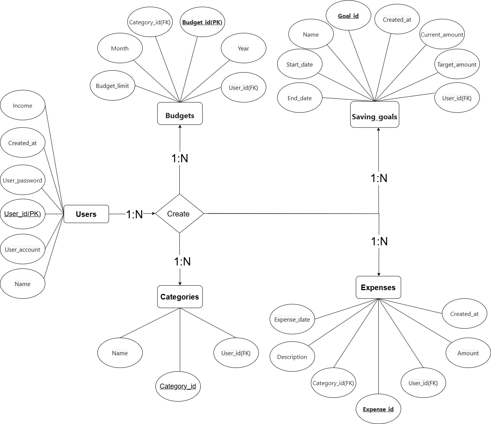

# 題目：記帳管理系統
在Amazon RDS建立一個雲端資料庫，可以供使用者記帳。用戶可以創建自己的帳號，可記錄總資產、收入、支出、財務總覽、交易紀錄、支出分類。
## 應用情境
1. 每月薪水規劃:
使用者每月領薪水後，將薪資輸入系統，設定儲蓄目標與每月各類支出上限，（例如：飲食 $6000，交通 $2000）。

2. 日常消費紀錄:
每花一筆錢，快速打開 App 記錄，可以透過標籤或分類，（如：飲食、交通、娛樂）整理資料。

3. 支出統計與趨勢分析:
自動生成月報表或週報表，顯示：每類支出金額、哪一天花最多錢、哪些分類超出預算。

5. 存錢挑戰與目標追蹤:
設定短期/中期儲蓄目標，（例如：三個月存$15000），系統追蹤進度，提醒用戶節制支出。

| 使用者        | 使用案例說明                                                             |    
|--------------|-------------------------------------------------------------------------|
| 學生         |平時紀錄一些生活花費(早餐、午餐、晚餐)，或者依些娛樂的費用。|
| 上班族       |清楚記錄每月的工資收入，以及平時的一些生活花費，也能規劃屬於自己的儲蓄目標。|
| 會計師       |紀錄平時公司的收支情況，也能在最後統整時將整體收支畫成圖表供老闆看。|

## 使用案例範例
| 使用情境           | 角色介紹                 | 案例描述                                                                 |
|--------------------|--------------------------|--------------------------------------------------------------------------|
| 每月薪水規劃       | 小宋，27 歲上班族      | 每月薪資 $35,000，設定飲食 $6000、交通 $2500 等預算，並目標每月存 $8000。系統會提醒她哪些項目快要超支。 |
| 日常消費紀錄       | 老高，21 歲大學生         | 每次花費後透過分類（如飲食、交通）快速記帳，使用「#朋友聚餐」等標籤補充內容。                       |
| 存錢挑戰與目標追蹤 | 小郭，23 歲社會新鮮人     | 設定三個月內存 $15,000 的旅費，系統每週追蹤儲蓄進度，未達標時發出提醒並給予鼓勵。                   |

<!--| 支出統計與趨勢分析 | 張三，30 歲軟體工程師     | 系統自動生成圖表顯示支出比例，幫助他發現外送支出過高並調整下月預算。                               |-->

## 資料表
### 📋 users 使用者資料表

| 欄位名稱      | 資料型別  | 限制條件                      | 說明       |
|--------------|-----------|-------------------------------|------------|
| user_id      | AUTO_INCREMENT| PRIMARY KEY                   | 使用者 ID  |
| user_account | VARCHAR(255) | UNIQUE,NOT NULL            | 使用者帳號 |
| user_password| VARCHAR(24)| NOT NULL                      | 使用者密碼 |
| name         | VARCHAR(50)  | NOT NULL                      | 姓名       |
| income       | INTEGER   | CHECK (income >= 0)           | 月收入     |
| created_at   | TIMESTAMP | DEFAULT CURRENT_TIMESTAMP     | 建立時間   |

### 📋 users 使用者資料表SQL
```sql
CREATE TABLE users (
    user_id INT AUTO_INCREMENT PRIMARY KEY,
    user_account VARCHAR(255) NOT NULL UNIQUE,
    user_password VARCHAR(24) NOT NULL,
    name VARCHAR(50) NOT NULL,
    income INT CHECK (income >= 0),
    created_at TIMESTAMP DEFAULT CURRENT_TIMESTAMP
);
```
---

### 📋 categories 支出分類表

| 欄位名稱   | 資料型別 | 限制條件                                | 說明         |
|------------|----------|-----------------------------------------|--------------|
| category_id| AUTO_INCREMENT| PRIMARY KEY                             | 分類 ID      |
| user_id    | INTEGER  | FOREIGN KEY → users(user_id)            | 使用者 ID    |
| name       | VARCHAR(50) | NOT NULL, UNIQUE(user_id, name)      | 分類名稱     |

### 📋 categories 支出分類表SQL
```sql
CREATE TABLE categories (
    category_id INT AUTO_INCREMENT PRIMARY KEY,
    user_id INT,
    name VARCHAR(50) NOT NULL,
    UNIQUE (user_id, name),
    FOREIGN KEY (user_id) REFERENCES users(user_id)
);
```
---

### 📋 expenses 支出紀錄表

| 欄位名稱     | 資料型別 | 限制條件                                  | 說明           |
|--------------|----------|-------------------------------------------|----------------|
| expense_id   | AUTO_INCREMENT   | PRIMARY KEY                               | 支出 ID        |
| user_id      | INTEGER  | FOREIGN KEY → users(user_id)              | 使用者 ID      |
| category_id  | INTEGER  | FOREIGN KEY → categories(category_id)     | 分類 ID        |
| amount       | INTEGER  | NOT NULL, CHECK (amount > 0)              | 支出金額       |
| description  | VARCHAR(255)|                                        | 支出說明       |
| expense_date | DATE     | NOT NULL                                  | 花費日期       |
| created_at   | TIMESTAMP| DEFAULT CURRENT_TIMESTAMP                 | 建立時間       |

### 📋 expenses 支出紀錄表SQL
```sql
CREATE TABLE expenses (
    expense_id INT AUTO_INCREMENT PRIMARY KEY,
    user_id INT,
    category_id INT,
    amount INT NOT NULL CHECK (amount > 0),
    description VARCHAR(255),
    expense_date DATE NOT NULL,
    created_at TIMESTAMP DEFAULT CURRENT_TIMESTAMP,
    FOREIGN KEY (user_id) REFERENCES users(user_id),
    FOREIGN KEY (category_id) REFERENCES categories(category_id)
);
```
---

### 📋 budgets 每月預算表

| 欄位名稱     | 資料型別 | 限制條件                                            | 說明             |
|--------------|----------|-----------------------------------------------------|------------------|
| budget_id    | AUTO_INCREMENT   | PRIMARY KEY                                         | 預算 ID          |
| user_id      | INTEGER  | FOREIGN KEY → users(user_id)                        | 使用者 ID        |
| category_id  | INTEGER  | FOREIGN KEY → categories(category_id)               | 分類 ID          |
| year         | INTEGER  | NOT NULL                                            | 年份             |
| month        | INTEGER  | NOT NULL, CHECK (month BETWEEN 1 AND 12)            | 月份             |
| budget_limit | INTEGER  | NOT NULL, CHECK (budget_limit >= 0)                 | 分類預算金額     |

### 📋 budgets 每月預算表SQL
```sql
CREATE TABLE budgets (
    budget_id INT AUTO_INCREMENT PRIMARY KEY,
    user_id INT,
    category_id INT,
    year INT NOT NULL,
    month INT NOT NULL CHECK (month BETWEEN 1 AND 12),
    budget_limit INT NOT NULL CHECK (budget_limit >= 0),
    FOREIGN KEY (user_id) REFERENCES users(user_id),
    FOREIGN KEY (category_id) REFERENCES categories(category_id)
);
```
---

### 📋 saving_goals 儲蓄目標表

| 欄位名稱       | 資料型別 | 限制條件                                | 說明             |
|----------------|----------|-----------------------------------------|------------------|
| goal_id        | AUTO_INCREMENT   | PRIMARY KEY                             | 目標 ID          |
| user_id        | INTEGER  | FOREIGN KEY → users(user_id)            | 使用者 ID        |
| name           | VARCHAR(50) | NOT NULL                             | 儲蓄目標名稱     |
| target_amount  | INTEGER  | NOT NULL, CHECK (target_amount > 0)     | 目標金額         |
| current_amount | INTEGER  | DEFAULT 0, CHECK (current_amount >= 0)  | 目前已儲蓄金額   |
| start_date     | DATE     | NOT NULL                                | 儲蓄開始日期     |
| end_date       | DATE     | NOT NULL                                | 儲蓄結束日期     |
| created_at     | TIMESTAMP| DEFAULT CURRENT_TIMESTAMP               | 建立時間         |

### 📋 saving_goals 儲蓄目標表SQL
```sql
CREATE TABLE saving_goals (
    goal_id INT AUTO_INCREMENT PRIMARY KEY,
    user_id INT,
    name VARCHAR(50) NOT NULL,
    target_amount INT NOT NULL CHECK (target_amount > 0),
    current_amount INT DEFAULT 0 CHECK (current_amount >= 0),
    start_date DATE NOT NULL,
    end_date DATE NOT NULL,
    created_at TIMESTAMP DEFAULT CURRENT_TIMESTAMP,
    FOREIGN KEY (user_id) REFERENCES users(user_id)
);
```
---

## ER Diagram(改)




## 🏆 團隊成員


| 成員 | 學號 | 班級 | 專題負責部分 |
|------|------|------|------|
| [宋協燦](./profile/宋協燦.md) | 41143214 | 資工三乙 | 
| [高浩城](./profile/高浩城.md) | 41143228 | 資工三乙 | 
| [張承翰](./profile/張承翰.md) | 41143230 | 資工三乙 | 
| [郭建杰](./profile/郭建杰.md) | 41143232 | 資工三乙 | 
