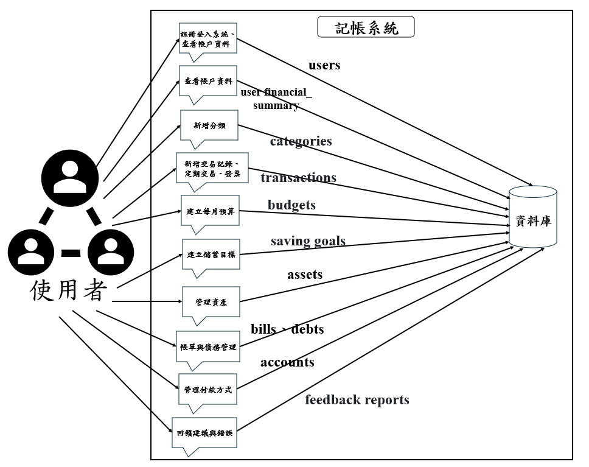
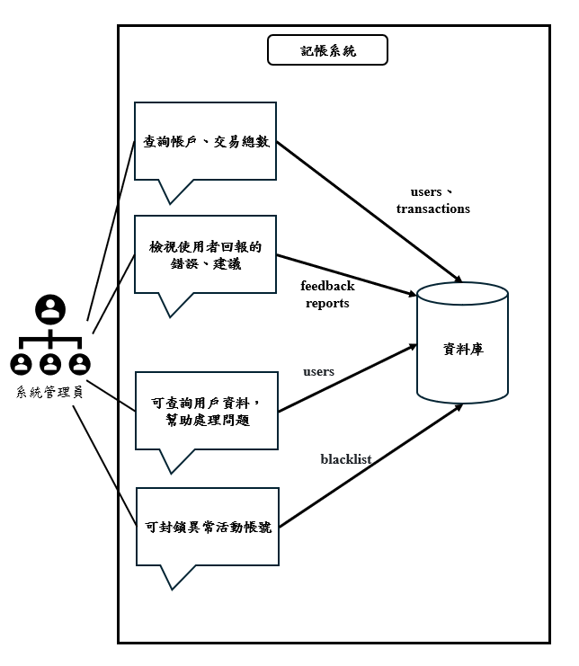
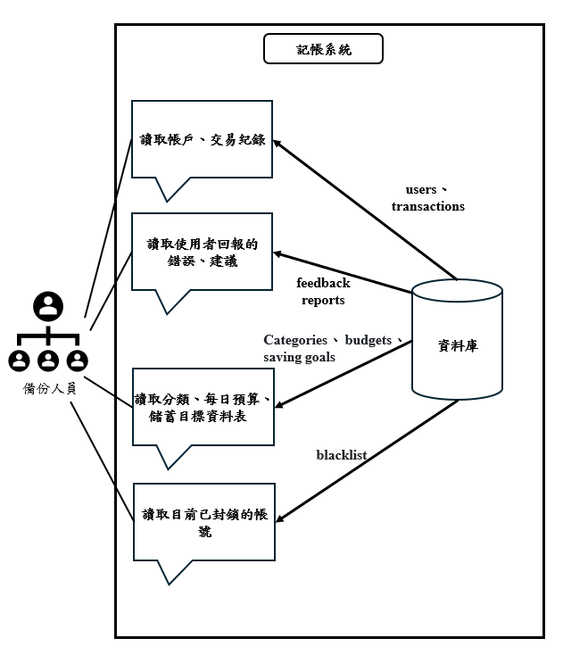
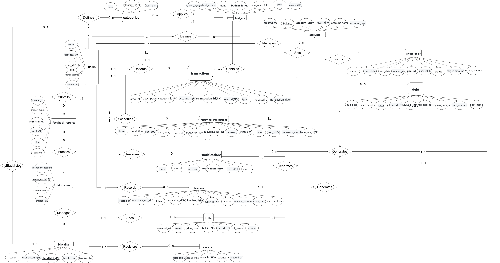
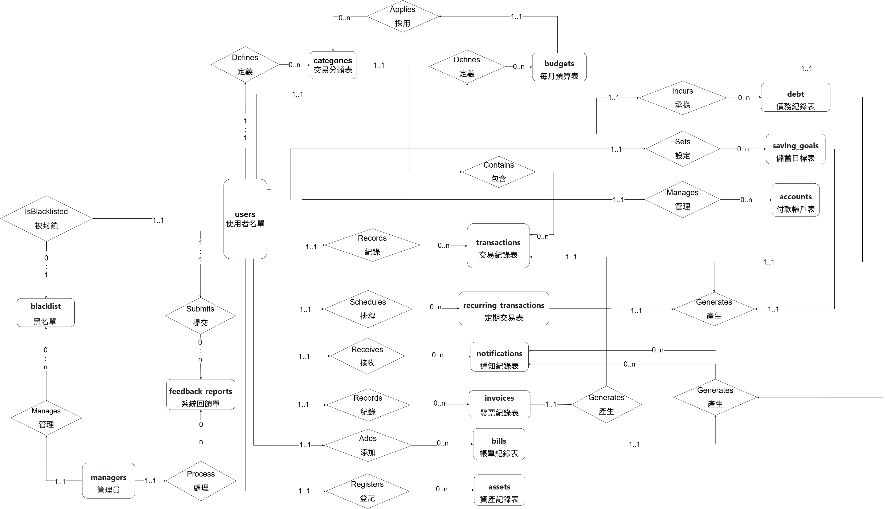

# G04 記帳管理系統
此專題利用Amazon RDS建立一個雲端資料庫，可以供不同使用者註冊帳號享有自己的雲端記帳系統，可以記錄自己的總資產並會隨著新增的收入支出去改變資產數，也可以對自己的交易去新增不同的類別，像是飲食、交通、公司開銷、旅遊等可以依照使用者需求去自訂。紀錄交易時系統會依照使用者選擇的是收入或支出去做不同的行為，例如這筆交易是收入，就將此交易的金額加入總資產，讓總資產可以隨著交易的紀錄靈活變動。用戶還能建立自己每個月的預算金額是多少，例如在2025年的1月在飲食上的預算是多少錢，系統也會記錄目前已經花了多少錢。除了上述功能，還能新增儲蓄目標讓使用者自行設定不同目標，像是筆電需要多少錢、從什麼時候開始、何時結束，系統會顯示目前已經儲蓄的金額跟該目標是否已經完成。

> [!IMPORTANT]
> ## 報告
> - [PPT期末簡報](https://www.canva.com/design/DAGooXezDFk/JuXnvlgG4OU5B8fCzmdRAA/view?utm_content=DAGooXezDFk&utm_campaign=designshare&utm_medium=link2&utm_source=uniquelinks&utlId=h7660f80551)
>
>- [Word期末報告](https://github.com/joshu0601/Database-G04/raw/main/report/資料庫期末報告.docx)


## 🏆 團隊成員
| 成員 | 學號 | 班級 | 專題負責部分 |
|------|------|------|------|
| [宋協燦](./profile/宋協燦.md) | 41143214 | 資工三乙 | 概念層建置 |
| [高浩城](./profile/高浩城.md) | 41143228 | 資工三乙 | VIEW表設計、實作、web實作 |
| [張承翰](./profile/張承翰.md) | 41143230 | 資工三乙 | 資料庫及資料表建置、web實作 |
| [郭建杰](./profile/郭建杰.md) | 41143232 | 資工三乙 | 概念層建置 |
---
# 📋記帳管理系統
## 應用情境
因應現代物價飛漲、科技發展迅速，除了原本生活必需品的壓力外，多了很多讓生活變得更加有效率的工具、要達到目的必須要提升的設備，例如：代替手寫筆記本的平板電腦、因為人工智慧的興起，需要可以支撐模型訓練的電腦設備與顯卡。現代人對於金錢的控管需求越來越大，要隨時記錄自己的花費、分配每個月的預算、設定儲蓄目標，而這個時候就可以使用我們的「雲端記帳系統」，滿足基礎的記帳收入支出需求、能對使用者自訂的飲食、交通等分類進行預算分配、設定存錢的目標。功能簡單便利、沒有過多複雜的步驟即可完成人們對記帳系統的需求。以下是使用該系統的例子：
### 分配每月預算：
小宋是一個上班族，每個月領完薪水之後需要負擔房租、水電費、卡債等花費，他想要控制每個月在每個領域的花費。小宋註冊完帳號後登入系統，建立新的分類是薪資、飲食、交通、玩樂。先新增一筆分類是薪資、類型是收入的交易。點選新增每月預算表，選擇飲食分類、填上年份與月份以及預算，依照此操作分別建立交通與玩樂的預算表。小宋在首頁就可以查看月報表或週報表，顯示每類支出金額、哪些分類超出預算。
#### 分配預算系統應用：
a.	使用者註冊完帳號後，系統會新增使用者、總資產，並將這些資訊同步於登入畫面後，方便使用者查看。<br>
b.	在新增分類自訂使用者的類別，讓後續的新增交易、每月預算表都可以按照這些分類去實施。<br>
c.	使用者新增一筆薪水的收入交易，系統會根據這筆交易的金額去更改該使用者的總資產。<br>
d.	使用者新增分類、交易、每月預算表後，系統會自動生成每種分類的收入與支出圖表，也會警示哪種分類快超出預算。<br>
### 設定儲蓄目標：
小宋在上班途中看到目前最新的顯卡推出了，因為要訓練人工智慧模型的需求較大，所以想要在平常的開銷外存一筆錢來購入新的設備。所以小宋登入系統，選擇新增儲蓄目標，設定這個儲蓄目標名稱是顯卡之旅，目標金額是80000，開始日期就設為下個月1號，結束日期設為半年後的1號。等到儲蓄開始日期到達後系統就會在首頁顯示當前儲蓄金額跟是否到期，目標還沒到達系統就會給予鼓勵，還會提醒使用者注意是否超支。
#### 設定儲蓄目標系統應用：
a.	使用者可以按照自己的步調去設定儲蓄目標的金額與開始日期。<br>
b.	系統會根據使用者建立的儲蓄目標顯示在主頁，如果目標沒有達成會鼓勵使用者。<br>
c.	 系統會幫使用者追蹤進度，讓用戶方便查看儲蓄目標達成與否。<br>
### 定期交易與帳單處理：
小宋想要可以自動記錄房租與薪水的收扣款，也想要有功能可以記錄每個月的水電費。所以他使用定期交易功能，把每個月的5號都設定成自動收扣款房租跟薪水。因為還有不定期且金額不相同的水電費帳單，所以小宋設定帳單來準備扣款水電費，設定截止日讓系統可以在快到截止日時通知使用者。
#### 定期交易與帳單處理系統應用：
a.	使用者根據自身需求去設定週期性的收扣款需求。<br>
b.	使用者對金額不相同的扣款設定成帳單來處理。<br>
c.	系統會根據快到期跟快收扣款給予使用者通知。<br>
### 管理個人財務：
小宋想要管理自己所投資的股票、購買的房產跟付款的帳戶。所以小宋利用系統中的資產管理、付款帳戶功能來達成。在資產分別新增狀態為Investment投資跟Property財產兩種的資料，讓小宋可以方便查看跟管理。在付款帳戶設定CreditCard信用卡、Cash現金兩種付款方式。這樣在往後新增交易跟管理資產上都可以方便查看與紀錄。
#### 管理個人財務系統應用：
a.	使用者根據自身的資產來新增並查看資產。<br>
b.	使用者可以選擇自己有的付款方式來新增。<br>
## 系統需求說明
雲端記帳系統主要是幫助使用者快速紀錄花費，還可以讓使用者分配飲食、交通等由用戶自己建立分類的每個月預算、儲蓄目標建立與追蹤。主要的功能為用戶管理、收入支出紀錄、建立每月預算表和儲蓄目標，也可以讓使用者建立定期收扣款的交易、管理資產、付款方式、帳單。
### 用戶管理
#### a.	可以用電子郵件進行註冊，也有忘記密碼與修改密碼功能。<br>
#### b.	可以修改使用者名稱、更換電子郵件。<br>
#### c.	支援依照分類名稱查詢交易明細和統計報表。<br>
#### d.	提供系統問題回報單，讓使用者可以回報系統錯誤。<br>
#### e.	提供使用者系統回饋表，可以給開發者更多功能的意見。<br>
---
### 交易紀錄
#### a.	使用者可以自訂每一筆交易、預算的分類，例如飲食、交通、薪資、樂透。<br>
#### b.	提供使用者選擇收入與支出選項，交易建立完成系統將會根據金額自動更改總資產數。<br>
#### c.	系統會顯示最近10筆交易是哪些分類、花了多少金額。<br>
#### d.	系統會在主畫面自動生成每一項分類的花費的圖表，提醒使用者哪一天是最高花費與哪一種分類花費最多。<br>
---
### 建立每月預算表
#### a.	使用者可以根據建立的分類去分配每月預算。<br>
#### b.	系統在首頁會顯示當月預算表與花費狀況，使用者可以查詢當前年份月份的預算花費狀況細節。<br>
#### c.	系統將在預算即將超標時警示使用者需要節制支出。<br>
---
### 建立儲蓄目標
#### a.	使用者可以根據某一目標建立存錢挑戰。<br>
#### b.	系統會自動將已經開始的儲蓄目標進度顯示在首頁。<br>
#### c.	系統會給予鼓勵並幫忙分析哪種類別花費最高與改善方法。<br>
---
### 規劃定期交易
#### a.	使用者可以設定金額相同、週期一致的交易，不用一直手動紀錄。<br>
#### b.	系統會根據使用者設定的時間發送通知並進行收扣款。<br>
---
### 資產管理
#### a.	使用者可以記錄銀行存款、投資、房地產、其他這四種狀態的資產。<br>
---
### 帳單管理
#### a.	使用者可以設定金額不同、有時限的需付款的交易。<br>
#### b.	系統會根據即將即期通知使用者要注意。<br>
---
### 系統通知
#### a.	系統會根據儲蓄目標即期與進度、預算超支、定期交易、債務與帳單即期來通知使用者需要注意。<br>
---
### 債務管理
#### a.	使用者可以記錄自己承擔的債務，會根據這筆債務的還款與否改變資料表的狀態。<br>
---
### 付款帳戶管理
#### a.	使用者可以建立現金、信用卡、銀行帳戶、電子支付四種付款方式。<br>
---
### 發票管理
#### a.	使用者可以新增發票。<br>
#### b.	系統會根據用戶新增的發票來新增對應的交易紀錄。<br>
---
### 管理員
#### a.	查看當前帳戶總數、總交易筆數。<br>
#### b.	檢視用戶提交的問題單，並向開發者回報系統錯誤。<br>
#### c.	監控系統是否有異常新增交易行為、資料庫連線錯誤紀錄。<br>
#### d.	可查詢使用者帳戶幫助協助問題處理，但無法看到帳號、總資產細節等。<br>
#### e.	可以對異常或有濫用行為的帳號做凍結。<br>
---
### 系統回饋
#### a.	使用者可以回報系統錯誤或是給予系統開發有更多建議。<br>
#### b.	管理員可以處理使用者回饋的訊息。<br>
---
### 黑名單
#### a.	使用者如果有異常活動管理員就可以封鎖該使用者帳號。<br>
#### b.	使用者登入前系統會先查詢黑名單裡面是不是有這位使用者。<br>

---
## 使用案例範例
| 使用情境           | 角色介紹                 | 案例描述                                                                 |
|--------------------|-----------------------------------|--------------------------------------------------------------------------|
| 每月薪水規劃       | 小宋，27 歲上班族      | 每月薪資 $35,000，設定飲食 $6000、交通 $2500 等預算，並目標每月存 $8000。系統會提醒她哪些項目快要超支。 |
| 日常消費紀錄       | 老高，21 歲大學生         | 每次花費後透過分類（如飲食、交通）快速記帳，使用「#朋友聚餐」等標籤補充內容。                       |
| 存錢挑戰與目標追蹤 | 小郭，23 歲社會新鮮人     | 設定三個月內存 $15,000 的旅費，系統每週追蹤儲蓄進度，未達標時發出提醒並給予鼓勵。                   |
| 支出統計與趨勢分析 | 張三，30 歲公司會計師    | 系統自動生成圖表顯示支出比例，幫助他跟老闆報告目前公司的收支情形。                               |
---
## 使用者案例圖

### a.	註冊登入系統：註冊成功將會新增一筆在users資料表的資料。登入時會透過users_account在users裡搜尋是否有該使用者的user_id，如果有就調用password DB來查找對應的密碼。<br>
### b.	查詢帳戶、各種紀錄：系統會透過查詢users找到帳戶資訊並用user_id從不同資料表中找到下列對應的資料，categories找到分類有哪些、transactions找到總共的交易總數、budgets找到預算表、saving_goals找到儲蓄目標表。<br>
### c.	新增分類：使用者新增飲食分類，系統會按照當前的user_id與分類名稱在categories新增一個可供用戶選擇的名稱。<br>
### d.	新增交易記錄、定期交易、發票：系統會按照user_id在transactions新增一筆資料。接著系統還會按照此次交易是收入或支出去對users裡的total_assets欄位進行更改。定期交易可以讓使用者對週期性、金額相同的收扣款資料作處理，像是房租、薪水等每個月固定收扣款的交易，讓使用者不用每次都自己新增。發票可以讓使用者新增後，讓系統自己新增一筆交易紀錄，去對應新增的發票。<br>
### e.	建立每月預算：新增成功時，系統會用對應的user_id建立一筆新預算，還會在首頁顯示當月預算。<br>
### f.	建立儲蓄目標：新增成功時，系統會用對應的user_id建立一筆新儲蓄目標，還會在首頁顯示已經開始的儲蓄目標進度。<br>
### g.	管理資產：新增成功時，系統會在該使用者user_id底下建立一筆投資、房產、銀行帳戶、其他的資產分類。<br>
### h.	帳單與債務處理：使用者可以新增有截止日的帳單資料，像是水費電費不是定期扣款的帳單，可以透過鄰近截止日讓系統通知使用者。除了帳單也可以新增使用者自己承擔的債務，像是房貸、卡債等都可以新增，方便使用者管理。<br>
### i.	管理付款方式：使用者可以新增'Bank'銀行, 'CreditCard'信用卡/金融卡, 'Cash'現金, 'Wallet'電子支付四種供使用者選擇。系統會根據選擇的付款方式在對應的user_id底下建立付款方式。<br>
### j.	回饋建議與錯誤：使用者利用回饋表單去反應系統還能添加什麼建議或是使用過程中哪邊出現的系統錯誤。<br>
---
## 管理員案例圖

### a.	登入系統：管理員透過管理帳戶登入系統，系統會查詢users資料表中管理員的user_id確認是管理員登入。<br>
### b.	查詢帳戶、交易總數：管理員查詢時會調用users、transactions兩種資料表中的欄位。<br>
### c.	檢視使用者回報的錯誤、建議：管理員可以檢視使用者回報單中的內容，並進行處理或上報開發團隊。<br>
### d.	監控系統與資料庫連線是否異常：管理員監視是否有異常交易資料的新增、資料庫連線是否有回傳錯誤訊息。<br>
### e.	可查詢用戶資料，幫助處理問題：在使用者出現帳戶問題，管理員可以查詢users資料表幫忙用戶確認資料。<br>
### f.	可封鎖異常活動帳號：管理員會查看使用者新增交易是否有異常活動，如果警告數次無果就進行封鎖。<br>

---
## 備份人員案例圖



---
## 使用者權限設定
#### 1. 一般使用者
| 資料表 | 權限 | 說明 |
|---------|---------|------|
| users   | 讀寫自己 |管理帳號|
|transactions|讀寫自己 |收支紀錄|
|categories | 讀寫自己 |類別管理|
|budgets    | 讀寫自己 |預算設定|
|saving_goals|讀寫自己 |儲蓄目標|
|VIEW表     | 讀寫自己 |僅供讀四個VIEW表|
|資料庫結構修改| 無法   |僅管理者可改 schema|
|資料備份/匯出 | 無法   |

#### SQL語法

```sql
CREATE USER 'customer'@'%' IDENTIFIED BY '1234';
GRANT SELECT, INSERT, UPDATE, DELETE ON accounting_system.* TO 'customer'@'%';
```

#### 2. 管理者
| 資料表 | 權限 | 說明 |
|-------|----------|--------|
| users   | 讀寫所有人 |管理帳號|
|transactions|讀寫所有人 |收支紀錄|
|categories | 讀寫所有人 |類別管理|
|budgets    | 讀寫所有人 |預算設定|
|saving_goals|讀寫所有人 |儲蓄目標|
|VIEW表     | 讀寫所有人 |僅供讀四個VIEW表|
|資料庫結構修改| 可以   |僅管理者可改 schema|
|資料備份/匯出 | 可以   |

#### SQL語法

```sql
CREATE USER 'manager'@'%' IDENTIFIED BY '5678';
GRANT SELECT, INSERT, UPDATE, DELETE ON accounting_system.* TO 'manager'@'%';
```


#### 3. 備份人員
| 資料表 | 權限 | 說明 |
|-------|----------|----------|
| users   | 只讀所有人 |管理帳號|
|transactions|只讀所有人 |收支紀錄|
|categories | 只讀所有人 |類別管理|
|budgets    | 只讀所有人 |預算設定|
|saving_goals|只讀所有人 |儲蓄目標|
|VIEW表     | 只讀所有人 |僅供讀四個VIEW表|
|資料庫結構修改| 無法   |僅管理者可改 schema|
|資料備份/匯出 | 可以   |

#### SQL語法

```sql
CREATE USER 'backup'@'%' IDENTIFIED BY '4321';
GRANT SELECT, INSERT, UPDATE, DELETE ON accounting_system.* TO 'backup'@'%';
```

## 資料表
### 資料表主鍵
| 資料表名稱              | 主鍵             |      說明                     |
|------------------------|-----------------|-------------------------------|
| managers               | manager_id      | 每個管理員都有一個唯一的編號 |
| users                  | users_id        | 每個使用者都有一個唯一的編號 |
| categories             | categorie_id    | 每個使用者建立的分類都有一個唯一的編號 |
| transactions           | transaction_id  | 每筆交易都有一個唯一的編號|
| recurring_transactions | recurring_id    | 每筆固定收支表都有一個唯一的編號|
| budgets                | budget_id       | 每個預算表都有一個唯一的編號|
| saving_goals           | goal_id         | 每個儲蓄目標都有一個唯一的編號|
| feedback_reports       | report_id       | 每個回饋表都有一個唯一的編號|
| blacklist              | blacklist_id    | 每個被封鎖的帳戶都有一個唯一的編號|
| notifications          | notification_id | 每則通知都有一個唯一的編號|
| debt                   | debt_id         | 每個債務紀錄都有一個唯一的編號|
| assets                 | asset_id        | 每個資產紀錄都有一個唯一的編號|
| bills                  | bill_id         | 每個帳單都有一個唯一的編號|
| invoices               | invoice_id      | 每張發票都有一個唯一的編號|
---
### 資料表外鍵
|    子資料表(Child Table)  |外鍵(Foreign Key)|  參照主資料表(Parent Table)  |                    說明            |
|--------------------------|-----------------|----------------|---------------------------------------------|
| categories               | user_id         | users          | 每一個類別都是關聯到一位已經註冊的使用者     |
| transactions             | user_id         | users          | 每一筆交易紀錄都是關聯到一位已經註冊的使用者 |
| transactions             | category_id     | categories     | 每一筆交易紀錄表會屬於一個已經建立的類別     |
| budgets                  | user_id         | users          | 每個每月預算表會關聯一位已經註冊的使用者     |
| budgets                  | category_id     | categories     | 每個每月預算表會屬於一個已經建立的類別       |
| saving_goals             | user_id         | users          | 每個儲蓄目標表會關聯到一個已經註冊的使用者    |
| blacklist                | user_account    | users          | 每個黑名單都有一個被封鎖的使用者帳號    |
| blacklist                | blocked_by      | managers       | 每個黑名單都有處理該事件的管理員    |
| recurring_transactions   | user_id         | users          | 每個定期交易都關聯到一位已經註冊的使用者建立    |
| recurring_transactions   | category_id     | categories     | 每個定期交易都屬於一個已經建立的類別    |
| feedback_reports         | user_id         | users          | 每個回饋單都是關聯到一位已經註冊的使用者    |
| debt                     | user_id         | users          | 每個債務錶都是關聯到一位已經註冊的使用者    |
| notifications            |  user_id        | users          | 每則通知都是關聯到一位已經註冊的使用者    |
|  assets                  | user_id         | users          | 每個資產錶都是關聯到一位已經註冊的使用者    |
|  bills                   | user_id         | users          | 每個帳單都是關聯到一位已經註冊的使用者    |
|  invoices                | user_id         | users          | 每張發票都是關聯到一位已經註冊的使用者    |
|  invoices                | transactions    | transactions_id| 每張發票都可以關聯到一筆已經建立的交易    |
---
## ER Diagram



## 簡易ER Diagram


### users：<br>
#### Defines  1..1 ⮕  0..n categories<br>
使用者去定義分類，用於紀錄交易跟分配預算。一個使用者可以創建零個到多個分類，例如飲食、交通、薪水、樂透等。每個分類屬於單一使用者。<br>
#### Records 1..1 ⮕  0..n transactions<br>
使用者去紀錄交易，分為收入與支出。一個使用者可以記錄零到多筆交易，利用建立好的類別來分配交易是屬於哪種收支。每筆交易屬於單一使用者。<br>
#### Schedules 1..1 ⮕  0..n recurring_transactions<br>
使用者安排定期交易，設定金額相同且重複發生的交易。一個使用者可以安排零到多筆定期交易，例如房租、薪水。每筆定期交易屬於單一使用者。<br>
#### Defines 1..1 ⮕  0..n budgets<br>
使用者去定義預算，管理並分配財務計畫或限制花費。一個使用者可以定義零到多個預算表，例如六月飲食花費、六月交通花費。每個預算屬於單一使用者。<br>
#### Sets 1..1 ⮕  0..n saving_goals<br>
使用者去設定儲蓄目標，規劃財務目標。一個使用者可以設定零到多個儲蓄目標，例如旅遊基金、硬體設備升級等。每個儲蓄目標屬於單一使用者。<br>
#### Incurs 1..1 ⮕  0..n debts<br>
使用者去承擔債務，承擔貸款或欠款。一個使用者可以承擔零到多筆債務，例如房貸、卡債等。每筆債務屬於單一使用者。<br>
#### Adds 1..1 ⮕  0..n bills<br>
使用者去添加帳單，添加金額不固定的待支付費用。一個使用者可以添加零到多筆帳單，例如水電費等。每個帳單屬於單一使用者。<br>
#### Manages 1..1 ⮕  0..n accounts<br>
使用者去管理付款帳戶，管理不同付款方式。一個使用者以添加零到多個付款帳戶，例如信用卡、銀行帳戶、現金等。每個付款帳戶屬於單一使用者。<br>
#### Receives 1..1 ⮕  0..n notifications<br>
使用者去接收通知，獲取系統發送的提醒。一個使用者可以接收零到多則通知，例如預算超支提醒、即將定期扣款訊息等。每則通知針對單一使用者。<br>
#### Submits 1..1 ⮕  0..n feedback_reports<br>
使用者去提交回饋單，提供系統建議或問題報告。一個使用者可以提交零到多筆回饋，例如增加功能、系統錯誤等。每個回饋來自單一使用者。<br>
#### IsBlacklisted 1..1 ⮕  0..1 blacklist<br>
使用者被列入黑名單，表示帳戶違規而受限。一個使用者最多被列入黑名單一次，每個黑名單對應單一使用者。<br>
### categories：<br>
#### Contains 1..1 ⮕  0..n transactions<br>
分類包含交易，將交易歸類到特定類別。一個分類可以包含零到多筆交易，例如飲食、交通都可以有很多筆交易。每筆交易屬於單一分類。<br>
### budgets：<br>
#### Applies 1..1 ⮕  0..n categories<br>
預算應用於分類，設定每項分類的預算。一個預算必須應用於一種類別，例如飲食預算、交通預算。每個類別可以被零到多筆預算應用。<br>
#### Generates 1..1 ⮕  0..n notifications<br>
預算產生通知，提醒使用者即將超支。一個預算可以產生多則通知，例如該筆預算即將超支。每則通知來自單一預算。<br>
### saving_goals：<br>
#### Generates 1..1 ⮕  0..n notifications<br>
儲蓄目標產生通知，提醒使用者即期或進度。一個儲蓄目標可以產生多則通知，例如儲蓄目標即將到期、儲蓄目標已完成。每則通知來自單一儲蓄目標。<br>
### debts：<br>
#### Generates 1..1 ⮕  0..n notifications<br>
債務產生通知，提醒使用者債務快即期。一個債務可以產生多則通知，例如債務即將到期。每則通知來自單一債務。<br>
### bills：<br>
#### Generates 1..1 ⮕  0..n notifications<br>
帳單產生通知，提醒使用者帳單快即期。一個帳單可以產生多則通知，例如帳單即將到期。每則通知來自單一帳單。<br>
### invoices：<br>
#### Generates 1..1 ⮕  1..1 transactions<br>
發票產生交易，根據發票建立交易紀錄。一張發票可以產生一次交易紀錄，根據發票細節與分類來產生交易紀錄。一張發票對應一次交易紀錄。<br>
### recurring_transactions：<br>
#### Generates 1..1 ⮕  0..n notifications<br>
定期交易產生通知，根據即將收扣款的訊息通知給使用者。一筆定期交易可以產生多則通知，例如即將收扣款、已經收扣款。每則通知來自單一定期交易。<br>
### managers：<br>
#### Process 1..1 ⮕  0..n feedback_reports<br>
管理員處理回饋，處理使用者的建議與回報系統錯誤。一個管理員可以處理零個或多個回饋單，例如處理新增功能、回報系統錯誤。每個回饋對應零個或一個管理員。<br>
#### Manages 1..1 ⮕  0..n blacklist<br>
管理員管理黑名單，維護和更新違規使用者的限制狀態。一個管理員可以管理零個或多個黑名單記錄，例如修改黑名單狀態或移除記錄。每個黑名單可由零個或一個管理員管理。<br>
## 資料表

### 📋 managers 管理員資料表

| 欄位名稱          | 資料型別  | 限制條件                       | 說明       |
|------------------|-----------|-------------------------------|------------|
| manager_id      | INTEGER   | PRIMARY KEY                    | 管理員 ID  |
| managers_account | CHAR(255) | UNIQUE,NOT NULL               | 管理員帳號 |
| managersname     | CHAR(50)  | NOT NULL                      | 姓名       |
| created_at       | TIMESTAMP | DEFAULT CURRENT_TIMESTAMP     | 建立時間   |

密碼存在另外的資料庫。

### 📋 managers 完整性限制

| 欄位名稱      | 限制條件                                                                                  |
|--------------|-------------------------------------------------------------------------------------------|
| managers_id      | 系統會依照管理員建立順序去對每個管理員給一個整數當作ID，該整數是從1開始的，每多一個管理員就+1 |
| managers_account | [1]                                                                                   |
| managersname     | 名稱只能是英文字母大小寫Aa到Zz、中文字，但不能有其他外文或特殊符號存在，長度最多為50         |
| created_at       | 建立時間格式為 yyyy-mm-dd，系統會設定使用者建立當下的時間為預設值                          |
---
[1]格式為 local-part@domain。local-part 僅能包含英文字母 a–z、A–Z、數字 0–9、特殊符號 !#$%&'*+-/=?^_`{|}~ 和 `.`，但點號不可作為開頭、結尾，亦不可連續出現，系統不接受 `"..."@domain` 的引號格式。<br>domain 為以點分隔的字串，每段最多 63 字元，總長不超過 255 字元，只能包含英數與 `-`（不可作為開頭或結尾），系統亦不接受 (test) 注釋形式。
### 📋 managers 管理員資料表 SQL
```sql
CREATE TABLE managers (
    manager_id INT AUTO_INCREMENT PRIMARY KEY,
    managers_account CHAR(255) UNIQUE NOT NULL,
    managersname CHAR(50) NOT NULL,
    created_at TIMESTAMP DEFAULT CURRENT_TIMESTAMP
);
```
---

### 📋 users 使用者資料表

| 欄位名稱      | 資料型別  | 限制條件                      | 說明       |
|--------------|-----------|-------------------------------|------------|
| user_id      | INTEGER | PRIMARY KEY                   | 使用者 ID  |
| user_account | CHAR(255) | UNIQUE,NOT NULL            | 使用者帳號 |
| name         | CHAR(50)  | NOT NULL                      | 姓名    |
| total_assets | INTEGER   |DEFAULT 0 CHECK (total_assets >= 0)| 總資產|
| created_at   | TIMESTAMP | DEFAULT CURRENT_TIMESTAMP     | 建立時間   |

密碼存在另外的資料庫。

### 📋 users 完整性限制

| 欄位名稱      | 限制條件                                                                              |
|--------------|---------------------------------------------------------------------------------------|
| user_id      | 系統會依照使用者建立順序去對每個使用者給一個整數當作ID，該整數是從1開始的，每多一個使用者就+1 |
| user_account  | [1] |
| name         | 名稱只能是英文字母大小寫Aa到Zz、中文字，但不能有其他外文或特殊符號存在，長度最多為50|
| total_assets | 總資產只能是數字0~9組成，不能有除數字以外或特殊符號，且必須大於0|
| created_at   | 建立時間格式為 yyyy-mm-dd，系統會設定使用者建立當下的時間為預設值|
---
[1]格式為 local-part@domain。local-part 僅能包含英文字母 a–z、A–Z、數字 0–9、特殊符號 !#$%&'*+-/=?^_`{|}~ 和 `.`，但點號不可作為開頭、結尾，亦不可連續出現，系統不接受 `"..."@domain` 的引號格式。<br>domain 為以點分隔的字串，每段最多 63 字元，總長不超過 255 字元，只能包含英數與 `-`（不可作為開頭或結尾），系統亦不接受 (test) 注釋形式。
### 📋 users 使用者資料表SQL
```sql
CREATE TABLE users (
    user_id INT AUTO_INCREMENT PRIMARY KEY,
    user_account CHAR(255) NOT NULL UNIQUE CHECK (user_account REGEXP '^[a-zA-Z0-9!#$%&''*+-/=?^_`{|}~.]+@[a-zA-Z0-9-]+(\\.[a-zA-Z0-9-]+)+$'),
    name CHAR(50) NOT NULL,
    total_assets INT DEFAULT 0 CHECK (total_assets >= 0),
    created_at TIMESTAMP DEFAULT CURRENT_TIMESTAMP
);
```
### 📋 users 使用者資料表SQL範例
```sql
INSERT INTO users (user_account, user_password, name, total_assets) VALUES
('xiaosong', 'abc123', '小宋', 350000),
('laogao', 'def456', '老高', 80000),
('xiaoguo', 'ghi789', '小郭', 28000),
('zhangsan', 'jkl000', '張三', 60000);
```
---
### 📋 categories 交易分類表

| 欄位名稱   | 資料型別 | 限制條件                                | 說明         |
|------------|----------|-----------------------------------------|--------------|
| category_id| INTEGER  | PRIMARY KEY                             | 分類 ID      |
| user_id    | INTEGER  | FOREIGN KEY → users(user_id)            | 使用者 ID    |
| name       | CHAR(50) | NOT NULL, UNIQUE(user_id, name)      | 分類名稱     |

### 📋 categories 完整性限制

| 欄位名稱   | 完整性限制                                                        |
|------------|----------------------------------------------------------------|
| category_id|  系統會根據使用者建立的類別去照順序編號，編號是從1開始的整數，只要分類建立就會+1|
| user_id    |   是users資料表中的ID，由數字1開始每次+1的編號  |
| name       | 分類的名稱可以是中文字、英文字，不能有特殊符號與數字   |

### 📋 categories 交易分類表SQL
```sql
CREATE TABLE categories (
    category_id INT AUTO_INCREMENT PRIMARY KEY,
    user_id INT,
    name CHAR(50) NOT NULL,
    UNIQUE (user_id, name),
    FOREIGN KEY (user_id) REFERENCES users(user_id)
);
```
### 📋 categories 交易分類表SQL範例
```sql
INSERT INTO categories (user_id, name) VALUES
(1, '飲食'), (1, '交通'),
(2, '飲食'), (2, '娛樂'),
(3, '旅遊'), (3, '飲料'),
(4, '業務開銷'), (4, '報帳用餐');
```
---

### 📋 transactions 交易紀錄表

| 欄位名稱     | 資料型別 | 限制條件                                  | 說明           |
|--------------|----------|-------------------------------------------|----------------|
| transaction_id   | INTEGER   | PRIMARY KEY                          | 交易 ID|
| user_id      | INTEGER  | FOREIGN KEY → users(user_id)              | 使用者 ID |
| category_id  | INTEGER  | FOREIGN KEY → categories(category_id)     | 分類 ID     |
| account_id   | INTEGER  | FOREIGN KEY → accounts(account_id)        | 付款方式 ID     |
| type         | CHAR(7)  |  NOT NULL CHECK(type='Income'ORtype='Expense')| 收入支出分類    |
| amount       |INT|               NOT NULL CHECK (amount >= 0)        | 金額       |
| transaction_date | DATE     | NOT NULL                             | 交易日期       |
| description   | CHAR(255)|                                         | 此項交易說明  |
| created_at   | TIMESTAMP|        DEFAULT CURRENT_TIMESTAMP         | 創建時間  |

### 📋 transactions 完整性限制

| 欄位名稱     | 完整性限制                                                              |
|--------------|----------------------------------------------------------------------|
| transaction_id | 系統會根據每一筆交易建立的順序去給該交易訂單一個編號，該編號是一個整數，從1開始的，每有一筆新訂單就+1|
| user_id      |由整數組成，不包含特殊符號、文字|
| category_id  |由整數組成，不包含特殊符號、文字|
| account_id  |由整數組成，不包含特殊符號、文字|
| type         |只能是Income或Expense兩種英文單字，不能含有數字、特殊符號、除這兩個英文單字外的英文字母|
|amount        |金額只能由0到9的數字去組成，不能為負數必須大於等於0，也不能包含文字、特殊符號|
| transaction_date |格式為 yyyy-mm-dd 。yyyy年是由0到9數字組成，第一位不得為0、mm月如果為個位數月份第一位必須輸入0且是由1到12數字組成、dd日如果為個位數日第一位必須輸入0且是由1到31數字組成，如果當月沒有31號，在存入資料庫前，系統會自動更改為30號。|
| description   |說明可以由中文字、英文字Aa到Zz、數字0到9組成，但不能包含特殊符號，長度最多為255|
| created_at   |系統會根據該交易建立當下紀錄時間，時間格式為yyyy年mm月dd日|

### 📋 transactions 交易紀錄表SQL
```sql
CREATE TABLE transactions (
    transaction_id INT AUTO_INCREMENT PRIMARY KEY,
    user_id INT,
    account_id INT,
    type CHAR(10) NOT NULL CHECK (type = 'Income' OR type = 'Expense'),
    amount INT NOT NULL CHECK (amount >= 0),
    category_id INT,
    transaction_date DATE NOT NULL,
    description CHAR(255),
    created_at TIMESTAMP DEFAULT CURRENT_TIMESTAMP,
    FOREIGN KEY (user_id) REFERENCES users(user_id),
    FOREIGN KEY (category_id) REFERENCES categories(category_id)
);
```
### 📋 transactions 交易紀錄表SQL範例
```sql
INSERT INTO transactions (user_id, type, amount, category_id, transaction_date, description)
VALUES
(1, 'Income', 35000, 2, '2025-05-01', '五月薪資'), -- 小宋的月薪
(1, 'Expense', 180, 1, '2025-05-02', '便當 #午餐'), -- 小宋的支出
(2, 'Income', 8000, 4, '2025-05-01', '兼職收入'), -- 老高的收入
(2, 'Expense', 120, 3, '2025-05-02', '滷味宵夜 #朋友聚餐'), -- 老高的支出
(3, 'Income', 28000, 6, '2025-05-01', '五月薪資'), -- 小郭的收入
(3, 'Expense', 1500, 5, '2025-05-05', '雲林高鐵票'), -- 小郭的支出
(4, 'Income', 60000, 8, '2025-05-01', '月薪 #公司'), -- 張三的收入
(4, 'Expense', 3200, 7, '2025-05-01', '部門聚餐'), -- 張三的支出
```


---

### 📋 recurring_transactions 定期交易表

| 欄位名稱         | 資料型別 | 限制條件                                                             | 說明           |
|-----------------|----------|---------------------------------------------------------------------|----------------|
| recurring_id    | INTEGER | PRIMARY KEY                                                          | 定期 ID|
| user_id         | INTEGER | FOREIGN KEY → users(user_id)                                         | 使用者 ID |
| category_id     | INTEGER | FOREIGN KEY → categories(category_id)                                | 分類 ID     |
| type            | CHAR(7) |  NOT NULL CHECK(type='Income' OR type='Expense')                     | 收入支出分類      |
| amount          |   INT   |               NOT NULL CHECK (amount >= 0)                           | 金額       |
| frequency       |CHAR(10) |NOT NULL CHECK (frequency IN ('Daily', 'Weekly', 'Monthly', 'Yearly'))| 週期       |
| frequency_day   |   INT   |CHECK(frequency_day BETWEEN 1 AND 31)                                 | 幾號、星期幾|
| frequency_month |   INT   |CHECK(frequency_month BETWEEN 1 AND 12 OR frequency_month IS NULL)    | 月份  |
| start_date      |   DATE  |     NOT NULL                                                         | 開始日期  |
| end_date        |   DATE  |                                                                      | 結束日期  |
| description     |CHAR(255)|                                                                      | 描述  |
| status          | CHAR(10)| DEFAULT 'Active' CHECK (status IN ('Active', 'Paused', 'Completed')) | 是否持續收扣款  |
| created_at      |TIMESTAMP|        DEFAULT CURRENT_TIMESTAMP                                     | 創建時間  |

### 📋 recurring_transactions 完整性限制

| 欄位名稱     | 完整性限制                                                              |
|--------------|----------------------------------------------------------------------|
| recurring_id    |由系統編號從0開始只要多了一筆定期交易單就會+1|
| user_id         |由整數0~9組成、系統編號，從0開始每多一個使用者就會+1|
| category_id     |由整數0~9組成、系統編號，從0開始每多一個分類就會+1 |
| type            |只能是'Income'、'Expense'兩種英文單字，不能有其他文字、數字、特殊符號|
| amount          |金額由0~9數字組成，不能含有文字、特殊符號|
| frequency       |只能是'Daily'、'Weekly'、'Monthly'、'Yearly'的英文單字，除了這四種不能有其他內容|
| frequency_day   |只能由數字組成，範圍是1~31的整數，不能含有文字、特殊符號|
| frequency_month |只能由數字組成，範圍是1~12的整數，不能含有文字、特殊符號|
| start_date      |格式為 yyyy-mm-dd 。yyyy年是由0到9數字組成，第一位不得為0、mm月如果為個位數月份第一位必須輸入0且是由1到12數字組成、dd日如果為個位數日第一位必須輸入0且是由1到31數字組成，如果當月沒有31號，在存入資料庫前，系統會自動更改為30號。|
| end_date        | 格式為 yyyy-mm-dd 。yyyy年是由0到9數字組成，第一位不得為0、mm月如果為個位數月份第一位必須輸入0且是由1到12數字組成、dd日如果為個位數日第一位必須輸入0且是由1到31數字組成，如果當月沒有31號，在存入資料庫前，系統會自動更改為30號。 |
| description     |可以由文字組成，不能含有數字、特殊符號|
| status          |只能是'Active'、'Paused'、'Completed'三種英文單字，不能有除這三種以外的文字與特殊符號|
| created_at      | 系統會根據該交易建立當下紀錄時間，時間格式為yyyy年mm月dd日|

### 📋 recurring_transactions 定期交易表 SQL
```sql
CREATE TABLE recurring_transactions (
    recurring_id INT AUTO_INCREMENT PRIMARY KEY,
    user_id INT NOT NULL,
    category_id INT NOT NULL,
    type CHAR(7) NOT NULL CHECK (type IN ('Income', 'Expense')),
    amount INT NOT NULL CHECK (amount >= 0),
    frequency CHAR(10) NOT NULL CHECK (frequency IN ('Daily', 'Weekly', 'Monthly', 'Yearly')),
    frequency_day INT CHECK(frequency_day BETWEEN 1 AND 31),
    frequency_month INT CHECK(frequency_month BETWEEN 1 AND 12 OR frequency_month IS NULL),
    start_date DATE NOT NULL,
    end_date DATE,
    description CHAR(255),
    created_at TIMESTAMP DEFAULT CURRENT_TIMESTAMP,
    status CHAR(10) DEFAULT 'Active' CHECK (status IN ('Active', 'Paused', 'Completed')),
    FOREIGN KEY (user_id) REFERENCES users(user_id),
    FOREIGN KEY (category_id) REFERENCES categories(category_id)
);
```
### 📋 recurring_transactions 定期交易表SQL範例
```sql
INSERT INTO transactions (user_id, type, amount, category_id, transaction_date, description)
VALUES
```
---

### 📋 budgets 每月預算表

| 欄位名稱     | 資料型別 | 限制條件                                            | 說明               |
|--------------|----------|-----------------------------------------------------|------------------|
| budget_id    | INTEGER  | PRIMARY KEY                                         | 預算 ID          |
| user_id      | INTEGER  | FOREIGN KEY → users(user_id)                        | 使用者 ID        |
| category_id  | INTEGER  | FOREIGN KEY → categories(category_id)               | 分類 ID          |
| year         | INTEGER  | NOT NULL                                            | 年份             |
| month        | INTEGER  | NOT NULL, CHECK (month BETWEEN 1 AND 12)            | 月份             |
| budget_limit | INTEGER  | NOT NULL, CHECK (budget_limit >= 0)                 | 分類預算金額      |
| spent_amount | INTEGER  | DEFAULT 0 CHECK (spent_amount >= 0)                 | 已花費預算       |

### 📋 budgets 完整性限制

| 欄位名稱     | 完整性限制                                                                          |
|--------------|----------------------------------------------------------------------------------|
| budget_id    | 系統會根據每個使用者建立預算表照順序給該表編號，此編號為由1開始的整數，有新的預算表就+1|
| user_id      |  由整數組成，不包含特殊符號、文字|
| category_id  |  由整數組成，不包含特殊符號、文字|
| year         | 年份為西元年，年份由四個數字組成，開頭不得為0，後三碼可以是0到9的數字去組成，不得含有文字、特殊符號|
| month        | 只能由數字1到12任一，不能含有文字、特殊符號|
| budget_limit | 只能有數字0到9去組成，不能含有文字、特殊符號，且該數字必須大於等於0，不得為負數   |
| spent_amount | 只能有數字0到9去組成，不能含有文字、特殊符號，且該數字必須大於等於0，不得為負數   |

### 📋 budgets 每月預算表SQL
```sql
CREATE TABLE budgets (
    budget_id INT AUTO_INCREMENT PRIMARY KEY,
    user_id INT,
    category_id INT,
    year INT NOT NULL,
    month INT NOT NULL CHECK (month BETWEEN 1 AND 12),
    budget_limit INT NOT NULL CHECK (budget_limit >= 0),
    spent_amount INT DEFAULT 0 CHECK (spent_amount >= 0),
    FOREIGN KEY (user_id) REFERENCES users(user_id),
    FOREIGN KEY (category_id) REFERENCES categories(category_id)
);
```
### 📋 budgets 每月預算表SQL範例
```sql
INSERT INTO budgets (user_id, category_id, year, month, budget_limit) VALUES
(1, 1, 2025, 5, 6000), (1, 2, 2025, 5, 2500),
(2, 3, 2025, 5, 3000), (2, 4, 2025, 5, 1500),
(3, 5, 2025, 5, 2000), (3, 6, 2025, 5, 800),
(4, 7, 2025, 5, 8000), (4, 8, 2025, 5, 4000);
```
---

### 📋 saving_goals 儲蓄目標表

| 欄位名稱       | 資料型別 | 限制條件                                | 說明             |
|----------------|----------|-----------------------------------------|------------------|
| goal_id        | INTEGER   | PRIMARY KEY                             | 目標 ID  |
| user_id        | INTEGER  | FOREIGN KEY → users(user_id)            | 使用者 ID        |
| name           | CHAR(50)   | NOT NULL                             | 儲蓄目標名稱     |
| target_amount  | INTEGER  | NOT NULL, CHECK (target_amount > 0)     | 目標金額         |
| current_amount | INTEGER  | DEFAULT 0, CHECK (current_amount >= 0)  | 目前已儲蓄金額   |
| start_date     | DATE     | NOT NULL                                | 儲蓄開始日期     |
| end_date       | DATE     | NOT NULL                                | 儲蓄結束日期     |
| created_at     | TIMESTAMP| DEFAULT CURRENT_TIMESTAMP               | 建立時間         |
| status     | VARCHAR(20)| DEFAULT 'Active' CHECK (status IN ('Active', 'Completed')) | 目標完成狀態|

### 📋 saving_goals 完整性限制

| 欄位名稱       | 完整性限制                                                             |
|----------------|----------------------------------------------------------------------|
| goal_id        | 系統會根據使用者建立的每個目標去照順序編號，該編號是從1開始的整數，每有一個目標就+1 |
| user_id        |    由整數組成，不包含特殊符號、文字     |
| name           | 目標名稱可以是英文、中文，不能含有數字、特殊符號，名稱長度最長可以到50個字|
| target_amount  | 目標金額只能由0到9的數字組成，不能為負數，且不得包含文字與特殊符號|
| current_amount | 儲蓄金額只能由0到9的數字組成，不能為負數，且不得包含文字與特殊符號，預設為0|
| start_date     | 格式為 yyyy-mm-dd 。yyyy年是由0到9數字組成，第一位不得為0、mm月如果為個位數月份第一位必須輸入0且是由1到12數字組成、dd日如果為個位數日第一位必須輸入0且是由1到31數字組成，如果當月沒有31號，在存入資料庫前，系統會自動更改為30號。|
| end_date       | 格式為 yyyy-mm-dd 。yyyy年是由0到9數字組成，第一位不得為0、mm月如果為個位數月份第一位必須輸入0且是由1到12數字組成、dd日如果為個位數日第一位必須輸入0且是由1到31數字組成，如果當月沒有31號，在存入資料庫前，系統會自動更改為30號。|
| created_at     | 建立時間會根據使用者建立該目標的當下去設定，格式為西元年yyyy年mm月dd日|
| status         | 狀態是會根據該目標完成與否去給定，只能是英文字母的Active、Completed，不能含有數字、特殊符號、除這兩個單字外的英文字母|

### 📋 saving_goals 儲蓄目標表SQL
```sql
CREATE TABLE saving_goals (
    goal_id INT AUTO_INCREMENT PRIMARY KEY,
    user_id INT,
    name CHAR(50) NOT NULL,
    target_amount INT NOT NULL CHECK (target_amount > 0),
    current_amount INT DEFAULT 0 CHECK (current_amount >= 0),
    start_date DATE NOT NULL,
    end_date DATE NOT NULL,
    status VARCHAR(20) DEFAULT 'Active' CHECK (status IN ('Active', 'Completed')),
    created_at TIMESTAMP DEFAULT CURRENT_TIMESTAMP,
    FOREIGN KEY (user_id) REFERENCES users(user_id)
);
```
### 📋 saving_goals 儲蓄目標表SQL範例
```sql
INSERT INTO saving_goals (user_id, name, target_amount, start_date, end_date) VALUES
(1, '每月儲蓄計畫', 8000, '2025-05-01', '2025-05-31'),
(2, '筆電基金', 20000, '2025-05-01', '2025-09-01'),
(3, '日本自由行基金', 15000, '2025-05-01', '2025-07-31'),
(4, '退休儲蓄目標', 1000000, '2025-01-01', '2035-01-01');
```
---
### 📋 feedback_reports 使用者問題回報與建議表

| 欄位名稱       | 資料型別 | 限制條件                                                  | 說明              |
|----------------|----------|---------------------------------------------------------|------------------|
| report_id      | INTEGER   | PRIMARY KEY                                            | 回報清單 ID       |
| user_id        | INTEGER   | FOREIGN KEY → users(user_id)                           | 使用者 ID        |
| report_type    | CHAR(10)  | NOT NULL,  CHECK (reprot_type IN ('Bug', 'Suggestion'))| 回報類型         |
| title          | CHAR(100) | NOT NULL                                               | 標題             |
| content        | CHAR(200) |NOT NULL                                                | 內容           |
| created_at     | TIMESTAMP | DEFAULT CURRENT_TIMESTAMP                              | 回報時間         |

### 📋 feedback_reports 使用者問題回報與建議表

| 欄位名稱       | 完整性限制                                                             |
|----------------|----------------------------------------------------------------------|
| report_id      | 由整數1開始計算，新增一筆資料就加1。只由數字組成，不能有文字或英文以及特殊符號。|
| user_id        |根據當前使用者的ID組成，只能有數字不能有文字或英文和特殊符號。|
| report_type    |只能是'Bug', 'Suggestion'兩種英文單字，不能有其他數字、文字、英文、特殊符號參雜。 |
| title          | 可以是英文、文字、數字組成，不能含有特殊符號，且總長不超過100個字。|
| content        | 可以是英文、文字、數字組成，不能含有特殊符號，且總長不超過100個字。 |
| created_at     | 格式YYYY-MM-DD hh-mm-ss，系統會根據當前時間去設定欄位。|

### 📋  feedback_reports 使用者問題回報與建議表 SQL
```sql
CREATE TABLE feedback_reports (
    report_id INT AUTO_INCREMENT PRIMARY KEY,
    user_id INT,
    report_type CHAR(10) NOT NULL CHECK (report_type IN ('Bug', 'Suggestion')),
    title CHAR(100) NOT NULL,
    content CHAR(200) NOT NULL,
    created_at TIMESTAMP DEFAULT CURRENT_TIMESTAMP,
    FOREIGN KEY (user_id) REFERENCES users(user_id)
);
```


---
### 📋 blacklist 黑名單

| 欄位名稱       | 資料型別 | 限制條件                                                  | 說明              |
|----------------|----------|---------------------------------------------------------|------------------|
| blacklist_id   | INTEGER  | PRIMARY KEY                                              | 黑名單 ID        |
| user_account   | CHAR(255)| FOREIGN KEY → users(user_account)                       |  使用者帳號       |
| blocked_by     | INT      |FOREIGN KEY → managers(manager_id)                        | 哪個管理員封鎖的   |
| reason         | CHAR(200)| NOT NULL                                                 | 封鎖原因         |
| blocked_at     | TIMESTAMP| DEFAULT CURRENT_TIMESTAMP	                               | 封鎖時間          |


### 📋 blacklist 黑名單

| 欄位名稱       | 完整性限制                                                             |
|----------------|----------------------------------------------------------------------|
| blacklist_id   |由整數1開始計算，新增一筆資料就加1。只由數字組成，不能有文字或英文以及特殊符號。 |
| user_account   |[2]|
| reason         | 可以由文字、英文、數字組成，不能含有特殊符號且長度不超過200個字。|
| blocked_at     | 格式YYYY-MM-DD hh-mm-ss，系統會根據當前時間去設定欄位。 |
| blocked_by     |由數字組成的管理員ID，根據管理員數量去增加ID編碼。 |

[2]格式為 local-part@domain。local-part 僅能包含英文字母 a–z、A–Z、數字 0–9、特殊符號 !#$%&'*+-/=?^_`{|}~ 和 `.`，但點號不可作為開頭、結尾，亦不可連續出現，系統不接受 `"..."@domain` 的引號格式。<br>domain 為以點分隔的字串，每段最多 63 字元，總長不超過 255 字元，只能包含英數與 `-`（不可作為開頭或結尾），系統亦不接受 (test) 注釋形式。

### 📋  blacklist 黑名單
```sql
CREATE TABLE blacklist (
    blacklist_id INT AUTO_INCREMENT PRIMARY KEY,
    user_account CHAR(50),
    reason CHAR(200) NOT NULL,
    blocked_at TIMESTAMP DEFAULT CURRENT_TIMESTAMP,
    blocked_by INT,
    FOREIGN KEY (user_account) REFERENCES users(user_account),
    FOREIGN KEY (blocked_by) REFERENCES managers(manager_id)
);
```


---
### 📋 debt 債務表

| 欄位名稱       | 資料型別 | 限制條件                                                  | 說明              |
|----------------|----------|---------------------------------------------------------|------------------|
| debt_id        |INTEGER   | PRIMARY KEY                                            | 債務表 ID       |
| user_id        |INTEGER   | FOREIGN KEY → users(user_id)                           | 使用者 ID         |
| debt_name        |CHAR(50)  | NOT NULL                                             | 債務名稱         |
| debt_amount      | INTEGER | NOT NULL                                              | 負債金額         |
| remaining_amount | INTEGER |NOT NULL                                               | 剩餘債務         |
| start_date     | TIMESTAMP | NOT NULL                                               | 債務開始時間     |
| due_date     | TIMESTAMP | NOT NULL                                                 | 債務到期日     |
| status     | CHAR(8) | DEFAULT 'Active',CHECK(status IN ('Active', 'Paid off'))     | 債務還款狀況     |
| created_at     | TIMESTAMP | DEFAULT CURRENT_TIMESTAMP                              |債務表建立時間    |

### 📋 debt 債務表

| 欄位名稱       | 完整性限制                                                             |
|----------------|----------------------------------------------------------------------|
| debt_id        |由整數1開始計算，新增一筆資料就加1。只由數字組成，不能有文字或英文以及特殊符號。|
| user_id        |根據當前使用者的ID組成，只能有數字不能有文字或英文和特殊符號。|
| debt_name        |可以由中文、英文組成，不能含有數字、特殊符號。 |
| debt_amount      | 可以由數字0~9組成，不能含有文字、特殊符號。|
| remaining_amount | 可以由數字0~9組成，不能含有文字、特殊符號。|
| start_date     | 格式為 yyyy-mm-dd 。yyyy年是由0到9數字組成，第一位不得為0、mm月如果為個位數月份第一位必須輸入0且是由1到12數字組成、dd日如果為個位數日第一位必須輸入0且是由1到31數字組成，如果當月沒有31號，在存入資料庫前，系統會自動更改為30號。 |
| due_date     |格式為 yyyy-mm-dd 。yyyy年是由0到9數字組成，第一位不得為0、mm月如果為個位數月份第一位必須輸入0且是由1到12數字組成、dd日如果為個位數日第一位必須輸入0且是由1到31數字組成，如果當月沒有31號，在存入資料庫前，系統會自動更改為30號。 |
| status     |只能是'Active','Paid off'兩種英文單字，不能含有其他文字或數字、特殊符號。 |
| created_at     | 格式YYYY-MM-DD hh-mm-ss，系統會根據當前時間去設定欄位。|

### 📋  debt 債務表 SQL
```sql
CREATE TABLE debts (
    debt_id INT AUTO_INCREMENT PRIMARY KEY,
    user_id INT NOT NULL,
    debt_name CHAR(50) NOT NULL CHECK(debt_name REGEXP '^[a-zA-Z\u4e00-\u9fa5]+$'),
    debt_amount INTEGER NOT NULL CHECK(debt_amount >= 0),
    remaining_amount INTEGER NOT NULL CHECK(remaining_amount >= 0),
    start_date DATE NOT NULL,
    due_date DATE NOT NULL,
    status CHAR(8) DEFAULT 'Active' CHECK(status IN ('Active', 'Paid off')),
    created_at TIMESTAMP DEFAULT CURRENT_TIMESTAMP,
    FOREIGN KEY (user_id) REFERENCES users(user_id)
);
```
---

### 📋 notifications 通知表

| 欄位名稱       | 資料型別 | 限制條件                                                                | 說明      |
|----------------|----------|-----------------------------------------------------------------------|-----------|
| notification_id|INTEGER   | PRIMARY KEY                                                           | 通知 ID    |
| user_id        |INTEGER   | FOREIGN KEY → users(user_id)                                          | 使用者 ID  |
| type           |CHAR(20)  | NOT NULL CHECK(type IN ('SavingGoal', 'Budget', 'Recurring','Debt','bills'))| 通知類型   |
| message        | CHAR(255)| NOT NULL                                                             | 通知訊息   |
| sent_at        | TIMESTAMP|DEFAULT CURRENT_TIMESTAMP                                             | 發送時間   | 
| status         | CHAR(10) | DEFAULT 'Unread' CHECK(status IN ('Unread', 'Read'))                 | 通知狀態   |

### 📋 notifications 完整性限制

| 欄位名稱       | 完整性限制                                                             |
|----------------|----------------------------------------------------------------------|
| notification_id| 由整數1開始計算，新增一筆資料就加1。只由數字組成，不能有文字或英文以及特殊符號。|
| user_id        | 根據當前使用者的ID組成，只能有數字不能有文字或英文和特殊符號。|
| type           | 只能是'SavingGoal'、 'Budget'、 'Recurring'、'Debt'、'bills'這五種英文字，不能有其他文字或數字和特殊符號|
| message        | 由英文、中文、數字組成，不能含有特殊符號|
| sent_at        | 系統通知使用者的時間，預設為當下時間，格式YYYY-MM-DD hh-mm-ss | 
| status         | 使用者是否已經看過此則通知，只能是'Unread'、'Read'這兩種英文單字，不能含有其他文字或數字和特殊符號|

### 📋  notifications 通知表 SQL
```sql
CREATE TABLE notifications (
    notification_id INT AUTO_INCREMENT PRIMARY KEY,
    user_id INT NOT NULL,
    type CHAR(20) NOT NULL CHECK (type IN ('SavingGoal', 'Budget', 'Recurring', 'Debt', 'bills')),
    message CHAR(255) NOT NULL,
    sent_at TIMESTAMP DEFAULT CURRENT_TIMESTAMP,
    status CHAR(10) DEFAULT 'Unread' CHECK(status IN ('Unread', 'Read')),
    FOREIGN KEY (user_id) REFERENCES users(user_id)
);
```
---

### 📋 accounts 付款帳戶紀錄表

| 欄位名稱     | 資料型別 | 限制條件                                                                   | 說明      |
|-------------|----------|---------------------------------------------------------------------------|-----------|
| account_id  | INTEGER   | PRIMARY KEY                                                              | 帳戶 ID    |
| user_id     | INTEGER   | FOREIGN KEY → users(user_id)                                             | 使用者 ID  |
| account_name| CHAR(20)  | NOT NULL CHECK (account_name REGEXP '^[a-zA-Z0-9\u4e00-\u9fa5]+$')       | 帳戶名稱   |
| account_type| CHAR(20)  | NOT NULL CHECK (account_type IN ('Bank', 'CreditCard', 'Cash', 'Wallet'))| 帳戶類型   |
| balance     | INTEGER  | NOT NULL CHECK(balance >= 0)                                              | 帳戶餘額   |
| created_at  | TIMESTAMP|DEFAULT CURRENT_TIMESTAMP                                                  | 建立時間   | 

### 📋 accounts 完整性限制

| 欄位名稱    | 完整性限制                                                             |
|-------------|----------------------------------------------------------------------|
| account_id  | 由整數1開始計算，新增一筆資料就加1。只由數字組成，不能有文字或英文以及特殊符號。|
| user_id     | 根據當前使用者的ID組成，只能有數字不能有文字或英文和特殊符號。|
| account_name| 由英文、中文、數字組成，不能含有特殊符號|
| account_type| 只能含有'Bank'、'CreditCard'、'Cash'、'Wallet'這四種英文單字，不能有其他文字或數字和特殊符號|
| balance     | 可以由數字0~9組成，不能含有文字、特殊符號。|
| created_at  | 格式YYYY-MM-DD hh-mm-ss，系統會根據當前時間去設定欄位。| 

### 📋  accounts 付款帳戶紀錄表 SQL
```sql
CREATE TABLE accounts (
    account_id INT AUTO_INCREMENT PRIMARY KEY,
    user_id INT NOT NULL,
    account_name CHAR(50) NOT NULL CHECK (account_name REGEXP '^[a-zA-Z0-9\u4e00-\u9fa5]+$'),
    account_type CHAR(20) NOT NULL CHECK (account_type IN ('Bank', 'CreditCard', 'Cash', 'Wallet')),
    balance INT NOT NULL CHECK (balance >= 0),
    created_at TIMESTAMP DEFAULT CURRENT_TIMESTAMP,
    FOREIGN KEY (user_id) REFERENCES users(user_id)
);
```


---

### 📋 assets 資產紀錄表

| 欄位名稱     | 資料型別 | 限制條件                                                                   | 說明      |
|-------------|----------|---------------------------------------------------------------------------|-----------|
| asset_id    |INTEGER   | PRIMARY KEY                                                               | 資產 ID    |
| user_id     |INTEGER   | FOREIGN KEY → users(user_id)                                              | 使用者 ID  |
| asset_type  |CHAR(20)  | NOT NULL CHECK(asset_type IN ('Bank', 'Investment', 'Property', 'Other')) | 資產類型   |
| balance     | INTEGER  | NOT NULL CHECK(balance >= 0)                                              | 資產金額   |
| created_at  | TIMESTAMP|DEFAULT CURRENT_TIMESTAMP                                                  | 建立時間   | 

### 📋 assets 完整性限制

| 欄位名稱    | 完整性限制                                                             |
|-------------|----------------------------------------------------------------------|
| asset_id    | 由整數1開始計算，新增一筆資料就加1。只由數字組成，不能有文字或英文以及特殊符號。 |
| user_id     |根據當前使用者的ID組成，只能有數字不能有文字或英文和特殊符號。|
| asset_type  |只能是'Bank'、'Investment'、'Property'、'Other'這四種英文單字，不能含有其他文字跟數字和特殊符號。 |
| balance     |由數字0-9組成且不能是負數|
| created_at  |使用者建立資產表時間，預設為當下時間，格式YYYY-MM-DD hh-mm-ss | 

### 📋  assets 資產紀錄表 SQL
```sql
CREATE TABLE assets (
      asset_id INT AUTO_INCREMENT PRIMARY KEY,
      user_id INT NOT NULL,
      asset_name CHAR(50) NOT NULL CHECK(asset_name REGEXP '^[a-zA-Z\u4e00-\u9fa5]+$'),
      asset_type CHAR(20) CHECK(asset_type IN ('Bank', 'Investment', 'Property', 'Other')),
      balance INT NOT NULL CHECK(balance >= 0),
      created_at TIMESTAMP DEFAULT CURRENT_TIMESTAMP,
      FOREIGN KEY (user_id) REFERENCES users(user_id)
  );
```
---
### 📋 bills 帳單紀錄表

| 欄位名稱   | 資料型別 | 限制條件                                                                   | 說明      |
|-----------|----------|---------------------------------------------------------------------------|-----------|
| bill_id   |INTEGER   | PRIMARY KEY                                                               | 帳單 ID    |
| user_id   |INTEGER   | FOREIGN KEY → users(user_id)                                              | 使用者 ID  |
| bill_name |CHAR(50)  | NOT NULL CHECK(bill_name REGEXP '^[a-zA-Z\u4e00-\u9fa5]+$')               | 帳單名稱   |
| amount    | INTEGER  | NOT NULL CHECK(amount >= 0)                                               | 帳單金額   |
| due_date  | TIMESTAMP|NOT NULL                                                                   | 到期日   | 
| status    | CHAR(10)|DEFAULT 'Pending' CHECK(status IN ('Pending', 'Paid', 'Overdue'))          | 付款狀態  | 
| created_at| TIMESTAMP|DEFAULT CURRENT_TIMESTAMP                                                  | 建立時間   | 

### 📋 bills 完整性限制

| 欄位名稱   | 完整性限制                                                             |
|-----------|----------------------------------------------------------------------|
| bill_id   | 由整數1開始計算，新增一筆資料就加1。只由數字組成，不能有文字或英文以及特殊符號。|
| user_id   |根據當前使用者的ID組成，只能有數字不能有文字或英文和特殊符號。|
| bill_name |帳單名稱不能含有數字、特殊符號，只能由英文、中文組成|
| amount    |金額由數字0-9組成，不能含有其他文字與特殊符號且不能是負數|
| due_date  |格式為 yyyy-mm-dd 。yyyy年是由0到9數字組成，第一位不得為0、mm月如果為個位數月份第一位必須輸入0且是由1到12數字組成、dd日如果為個位數日第一位必須輸入0且是由1到31數字組成，如果當月沒有31號，在存入資料庫前，系統會自動更改為30號。| 
| status    |只能是'Pending'、'Paid'、'Overdue'三種英文單字，不能含有其他文字或數字和特殊符號| 
| created_at|使用者建立帳單時間，預設為當下時間，格式YYYY-MM-DD hh-mm-ss | 

### 📋  bills 帳單紀錄表 SQL
```sql
CREATE TABLE bills (
      bill_id INT AUTO_INCREMENT PRIMARY KEY,
      user_id INT NOT NULL,
      bill_name CHAR(50) NOT NULL CHECK(bill_name REGEXP '^[a-zA-Z\u4e00-\u9fa5]+$'),
      amount INT NOT NULL CHECK(amount >= 0),
      due_date DATE NOT NULL,
      status CHAR(10) DEFAULT 'Pending' CHECK(status IN ('Pending', 'Paid', 'Overdue')),
      created_at TIMESTAMP DEFAULT CURRENT_TIMESTAMP,
      FOREIGN KEY (user_id) REFERENCES users(user_id)
  );
```
---

### 📋 invoices 發票紀錄表

| 欄位名稱        | 資料型別 | 限制條件                                                     | 說明      |
|----------------|----------|-------------------------------------------------------------|-----------|
| invoice_id     |INTEGER   | PRIMARY KEY                                                 | 帳單 ID    |
| user_id        |INTEGER   | FOREIGN KEY → users(user_id)                                | 使用者 ID  |
| transaction_id | INTEGER  | FOREIGN KEY → transactions(transaction_id)                  | 交易ID   | 
| invoice_number | CHAR(10) | NOT NULL                                                    | 發票號碼   |
| amount         | INTEGER  | NOT NULL CHECK(amount >= 0)                                 | 發票金額   |
| issue_date     | DATE     |NOT NULL                                                     | 發票開立日   | 
| merchant_name  | CHAR(100)|                                                             | 賣方名稱  | 
| merchant_tax_id| CHAR(8)  |                                                             | 賣方統編   | 
| status         | CHAR(8)  |DEFAULT 'Pending' CHECK(status IN ('Pending', 'Won', 'Lost'))| 發票狀態   | 
| created_at     | TIMESTAMP|DEFAULT CURRENT_TIMESTAMP                                    | 建立時間   | 
### 📋 invoices 完整性限制

| 欄位名稱        | 完整性限制                                                             |
|----------------|----------------------------------------------------------------------|
| invoice_id     |由整數1開始計算，新增一筆資料就加1。只由數字組成，不能有文字或英文以及特殊符號。|
| user_id        |根據當前使用者的ID組成，只能有數字不能有文字或英文和特殊符號。|
| transaction_id |由整數1開始計算，新增一筆資料就加1。只由數字組成，不能有文字或英文以及特殊符號。| 
| invoice_number |發票號碼由數字與英文字組成，固定長度為10，兩個大寫英文字+8碼數字。英文字母範圍是AA-ZZ、數字範圍是00000001-99999999，不能含有特殊符號|
| amount         |金額由數字0-9組成，不能含有其他文字與特殊符號且不能是負數|
| issue_date     | 格式為 yyyy-mm-dd 。yyyy年是由0到9數字組成，第一位不得為0、mm月如果為個位數月份第一位必須輸入0且是由1到12數字組成、dd日如果為個位數日第一位必須輸入0且是由1到31數字組成，如果當月沒有31號，在存入資料庫前，系統會自動更改為30號。  | 
| merchant_name  |可以由中文與英文、數字組成，不能含有特殊符號。 | 
| merchant_tax_id|由整數組成固定長度8碼。| 
| status         |發票狀態只能是'Pending'、'Won'、'Lost'三種英文單字，不能含有其他文字、數字、特殊符號| 
| created_at     | 使用者建立發票紀錄時間，預設為當下時間，格式YYYY-MM-DD hh-mm-ss| 

### 📋  invoices 發票紀錄表 SQL
```sql
CREATE TABLE invoices (
    invoice_id INT AUTO_INCREMENT PRIMARY KEY,
    user_id INT NOT NULL,
    invoice_number CHAR(10) NOT NULL CHECK (invoice_number REGEXP '^[A-Z]{2}[0-9]{8}$'),
    amount INT NOT NULL, 
    issue_date DATE NOT NULL, 
    merchant_name CHAR(100),
    merchant_tax_id CHAR(8), 
    transaction_id INT, 
    status CHAR(8) DEFAULT 'Pending' CHECK(status IN ('Pending','Won', 'Lost')) ,
    created_at TIMESTAMP DEFAULT CURRENT_TIMESTAMP,
    FOREIGN KEY (user_id) REFERENCES users(user_id),
    FOREIGN KEY (transaction_id) REFERENCES transactions(transaction_id),
    CONSTRAINT unique_invoice UNIQUE (user_id, invoice_number, issue_date)
);
```
---

### VIEW表設計
#### a.一般使用者
| 名稱              | 選擇的屬性                                                                                                                                | 說明                                                                                         |
| :-------------- | :----------------------------------------------------------------------------------------------------------------------------------- | :----------------------------------------------------------------------------------------- |
| 儲蓄目標進度       | •`saving_goals(goal_id, name, target_amount, current_amount, start_date, end_date, created_at, status)`<br>• `users(name)`          | 可以查看資料庫內有創建儲蓄目標所有人的名字、開始結束儲蓄時間、目標金額、目前已存的金額以及狀態，之後可以再利用這個表來找出特定人有關於儲蓄目標的資料且能算出離目標還差多少金額、多少時間...等。 |
| 交易紀錄         | •`transactions(transaction_id, type, amount, transaction_date, description, created_at)`<br>• `categories(name)`<br>• `users(name)` | 可以查看資料庫內所有人的名字、每筆交易紀錄（含交易日期、金額、類別），之後也能透過此表查詢出想要的人的所有交易紀錄。                                 |
| 個人資料         | •`users(user_id, user_account, name, total_assets, created_at)`<br>• `transactions(type, amount)`                                   | 可以查看資料庫內所有人的個人資料（含名字、總資產、創建時間、帳號），以及他交易的總支出含總花費，之後也能透過此表查詢出想要的人的個人資料。                      |
| 所有分類的總收入與總支出 | •`users(user_id, name)`<br>• `categories(category_id, name)`<br>• `transactions(type, amount)`                                      | 可以查看資料庫內所有人每種分類的總收入以及總支出，所以會從資料庫拿每種分類下的收入以及支出做運算，以便之後實現能讓使用者查看個人帳戶下的所有分類的總收支。              |
| 每月預算 | • `users(user_id, name)`<br>•`categories(category_id)`<br>• `budget(year,month,budget_limit, spent_amount)`                                      | 可以查看資料庫內有創建每月預算表內每人每月在每分類所設定的預算，裡面會從category、budgets、users三個資料表內拿資料做整合運算，以便之後查詢特定人旗下的所有分類之預算。              |
| 年度總結 | • `users(user_id, name)`<br>•`categories(category_id)`<br>•`budget(year,month,budget_limit, spent_amount)`                                      | 可以查看在這資料庫內所有人的在同一年內的所有收支情況，所以這個VIEW表裡面會從users、transactions兩個表拿資料做整合運算，以便之後要查詢特定人在特定一年內的總收支情況。              |
| 月總收支報表 | • `users(user_id, name)`<br>•`categories(category_id,name,)`<br>•`transactions(user_id, transaction_date,type,amount)`                                      | 可以查看所有人在每年每個月每個分類的總收入及總支出及這個分類的花費占總花費的百分比，所以會從users、transaction、categories三個資料表中拿資料做整合運算，以便之後查詢特定使用者在每個分類的收支情況。              |
| 帳單狀態 | •`users(user_id, name)`<br>•`bills(user_id,bill_id,bill_name, amount,due_date,status)`| 可以查看資料庫內所有人的帳單狀態、逾期的時間、金額等，所以會從bills、users這兩個表內拿資料整合運算，以便之後可以直接查詢特定使用者旗下的所有帳單。              |
| 資產與債務狀態 | •`users(user_id, name,total_assets)`<br>•`assets(user_id,balance)`<br>•`debts(user_id,remaining_amount)`| 可以查看所有人旗下的總資產(users表)、資產總金額(assets表)、債務總金額及資產與債務相差多少錢，所以會從users、assets、debts三個表中拿資料出來整合運算，以便之後查詢特定使用者的資產與債務狀態。              |
| 發票分類管理 | •`invoices(invoice_id,user_id, invoice_number,amount,issue_date, merchant_name,merchant_tax_id, transaction_id,created_at,)`<br>•`transactions(category_id)`<br>•`categories(name)`| 可以查看所有人在每個分類裡面有哪些發票，所以會從invoices、transactions、categories三個資料表拿資料出來整合運算，以便之後特定使用者想要查詢自己旗下每個分類下的發票。              |


### 儲蓄目標進度VIEW表SQL
```sql
CREATE VIEW saving_goal_status AS
SELECT 
    sg.goal_id,
    u.name AS user_name,
    sg.name AS goal_name,
    sg.target_amount,
    sg.current_amount,
    sg.status,
    sg.start_date,
    sg.end_date,
    CASE 
        WHEN DATEDIFF(sg.end_date, CURDATE()) < 0 THEN 0
        ELSE DATEDIFF(sg.end_date, CURDATE())
    END AS remaining_days
FROM saving_goals sg
JOIN users u ON sg.user_id = u.user_id;
```
### 交易紀錄VIEW表SQL
```sql
CREATE VIEW user_transaction_history AS
SELECT 
    t.transaction_id,
    u.name AS user_name,
    t.type,
    t.amount,
    c.name AS category_name,
    t.transaction_date,
    t.description
FROM transactions t
JOIN users u ON t.user_id = u.user_id
JOIN categories c ON t.category_id = c.category_id;
```
### 個人資料VIEW表SQL
```sql
CREATE VIEW user_financial_summary AS
SELECT 
    u.user_id,
    u.name,
    u.user_account,
    u.total_assets,
    IFNULL(SUM(CASE WHEN t.type = 'Income' THEN t.amount ELSE 0 END), 0) AS total_income,
    IFNULL(SUM(CASE WHEN t.type = 'Expense' THEN t.amount ELSE 0 END), 0) AS total_expense
FROM users u
LEFT JOIN transactions t ON u.user_id = t.user_id
GROUP BY u.user_id, u.name, u.user_account, u.total_assets;
```
### 所有分類的總收入與總支出VIEW表SQL
```sql
CREATE VIEW user_category_summary AS
SELECT
    u.user_id,
    u.name AS user_name,
    c.category_id,
    c.name AS category_name,
    IFNULL(SUM(CASE WHEN t.type = 'Income' THEN t.amount ELSE 0 END), 0) AS total_income,
    IFNULL(SUM(CASE WHEN t.type = 'Expense' THEN t.amount ELSE 0 END), 0) AS total_expense
FROM users u
JOIN categories c ON u.user_id = c.user_id
LEFT JOIN transactions t ON t.user_id = u.user_id AND t.category_id = c.category_id
GROUP BY u.user_id, u.name, c.category_id, c.name;
```
### 每月預算查詢VIEW表SQL
```sql
CREATE VIEW monthly_budget_summary AS
SELECT 
  u.user_id,
  u.name AS user_name,
  c.category_id,
  c.name AS category_name,
  b.year,
  b.month,
  b.budget_limit,
  b.spent_amount,
  (b.budget_limit - b.spent_amount) AS remaining_budget
FROM users u
JOIN categories c ON u.user_id = c.user_id
JOIN budgets b ON b.user_id = u.user_id AND b.category_id = c.category_id;
```
### 年度總結VIEW表SQL
```sql
CREATE VIEW annual_financial_summary AS
SELECT 
    u.user_id,
    u.name AS user_name,
    YEAR(t.transaction_date)AS year,
    IFNULL(SUM(CASE WHEN t.type='income' THEN t.amount ELSE 0 END),0) AS total_income,
    IFNULL(SUM(CASE WHEN t.type='Expense' THEN t.amount ELSE 0 END),0) AS total_expense,
    IFNULL(SUM(CASE WHEN t.type='Income' THEN t.amount ELSE 0 END),0) - IFNULL(SUM(CASE WHEN t.type='Expense' THEN t.amount ELSE 0 END),0) AS total_saving
FROM users u
LEFT JOIN transactions t ON u.user_id = t.user_id
GROUP BY u.user_id,u.name,YEAR(t.transaction_date);
```
---
### 月總收支報表VIEW表SQL
```sql
CREATE VIEW monthly_report_summary AS
SELECT 
    t.user_id,
    u.name AS user_name,
    YEAR(t.transaction_date) AS year,
    MONTH(t.transaction_date) AS month,
    SUM(CASE WHEN t.type = 'Income' THEN t.amount ELSE 0 END) AS total_income,
    SUM(CASE WHEN t.type = 'Expense' THEN t.amount ELSE 0 END) AS total_expense,
    c.category_id,
    c.name AS category_name,
    SUM(CASE WHEN t.type = 'Expense' THEN t.amount ELSE 0 END) AS category_expense,
    (SUM(CASE WHEN t.type = 'Expense' THEN t.amount ELSE 0 END) * 100.0) / 
    (SELECT SUM(amount) FROM transactions t2 WHERE t2.user_id = t.user_id 
     AND t2.type = 'Expense' 
     AND YEAR(t2.transaction_date) = YEAR(t.transaction_date) 
     AND MONTH(t2.transaction_date) = MONTH(t.transaction_date)) AS expense_percentage
FROM transactions t
JOIN users u ON t.user_id = u.user_id
JOIN categories c ON t.category_id = c.category_id
GROUP BY t.user_id, u.name, YEAR(t.transaction_date), MONTH(t.transaction_date), c.category_id, c.name
HAVING category_expense > 0;
```
---
### 帳單狀態VIEW表SQL
```sql
CREATE VIEW bill_status_summary AS
  SELECT 
      b.user_id,
      u.name AS user_name,
      b.bill_id,
      b.bill_name,
      b.amount,
      b.due_date,
      b.status,
      CASE 
          WHEN b.status = 'Pending' AND b.due_date < CURDATE() THEN '逾期'
          WHEN b.status = 'Pending' AND b.due_date <= CURDATE() + INTERVAL 3 DAY THEN '即將到期'
          ELSE b.status
      END AS bill_status,
      SUM(b.amount) AS monthly_bill_total
  FROM bills b
  JOIN users u ON b.user_id = u.user_id
  WHERE b.due_date >= DATE_SUB(CURDATE(), INTERVAL 1 MONTH)
  GROUP BY b.user_id, u.name, b.bill_id, b.bill_name, b.amount, b.due_date, b.status;
```
---
### 資產與債務狀態VIEW表SQL
```sql
CREATE VIEW net_worth_summary AS
  SELECT 
      u.user_id,
      u.name AS user_name,
      u.total_assets,
      SUM(a.balance) AS total_asset_balance,
      SUM(d.remaining_amount) AS total_debt,
      SUM(a.balance) - SUM(d.remaining_amount) AS net_worth
  FROM users u
  LEFT JOIN assets a ON u.user_id = a.user_id
  LEFT JOIN debts d ON u.user_id = d.user_id
  GROUP BY u.user_id, u.name, u.total_assets;
```

---
### 發票種類VIEW表SQL
```sql
CREATE VIEW invoice_with_category AS
SELECT
    i.invoice_id,
    i.user_id,
    i.invoice_number,
    i.amount,
    i.issue_date,
    i.merchant_name,
    i.merchant_tax_id,
    i.transaction_id,
    i.created_at,
    t.category_id,
    c.name AS category_name
FROM
    invoices i
LEFT JOIN
    transactions t ON i.transaction_id = t.transaction_id
LEFT JOIN
    categories c ON t.category_id = c.category_id;
```
---
### 發票分類管理VIEW表SQL
```sql
CREATE VIEW invoice_with_category AS
SELECT
    i.invoice_id,
    i.user_id,
    i.invoice_number,
    i.amount,
    i.issue_date,
    i.merchant_name,
    i.merchant_tax_id,
    i.transaction_id,
    i.created_at,
    t.category_id,
    c.name AS category_name
FROM
    invoices i
LEFT JOIN
    transactions t ON i.transaction_id = t.transaction_id
LEFT JOIN
    categories c ON t.category_id = c.category_id;
```

#### b.管理員
| 名稱              | 選擇的屬性                                                                                                                                | 說明                                                                                         |
| :---------------- | :--------------------------------------------------------------------------------------------------------------------------------------- | :------------------------------------------------------------------------------------------ |
| 系統內總用戶數及總交易數 | •`transaction(user_id,transaction_date)`<br>•`users(name,transaction_date)`                                                       | 裡面可以查詢到總共有多少用戶在我們系統以及每位用戶所創建的總交易數|
| 查看問題回報單     | •`feedback_reports(report_id,user_id,report_type,title,content,created_at)`<br>•`users(name)`                                          | 可以查詢到所有使用者創建的問題回報單以及系統回饋表|
| 查看黑名單        | •`blacklist(blacklist_id,user_id,reason,blocked_at,blocked_by,)`<br>•`users(name)`<br>•`managers(managersname)`                       | 可以查看有哪些使用者在黑名單內|

### 查看系統內總用戶數及總交易數VIEW表SQL
```sql
CREATE VIEW system_overview AS
SELECT 
    t.user_id AS user_id,
    u.name AS user_name,
    t.transaction_date AS transaction_date,
    COUNT(*) AS daily_transaction_count
FROM transactions t
JOIN users u ON t.user_id = u.user_id
GROUP BY t.user_id, u.name, t.transaction_date;
```
### 查看問題回報單及系統回饋表VIEW表SQL
```sql
CREATE VIEW feedback_bug_reports AS
SELECT 
    fr.report_id AS report_id,
    fr.user_id AS user_id,
    u.name AS user_name,
    fr.report_type AS report_type,
    fr.title AS title,
    fr.content AS content,
    fr.created_at AS created_at
FROM feedback_reports fr
JOIN users u ON fr.user_id = u.user_id;
```
### 查看黑名單VIEW表SQL
```sql
CREATE VIEW blacklist_monitor AS
SELECT 
    b.blacklist_id AS blacklist_id,
    b.user_id AS user_id,
    u.name AS user_name,
    b.reason AS reason,
    b.blocked_at AS blocked_at,
    b.blocked_by AS blocked_by,
    m.managersname AS manager_name
FROM blacklist b
JOIN users u ON b.user_id = u.user_id
JOIN managers m ON b.blocked_by = m.manager_id;
```
## 心得
### 41143214 宋協燦
這堂課教會我市面上隨處可見的資料庫系統基礎，從依照需求設計資料表，到實際利用SQL語法建置資料庫，都讓我學到很多處理上的細節。最初沒想到設計資料庫需要注意每一項欄位的限制，認為就按照欄位的需要去給出相對應的值就行了，但實務上就需要考慮會遇到的各種狀況，來避免資料庫的崩潰。有了這些基礎就能設計資料庫專題，我們選擇從頭開始處理記帳管理系統。我們參考了市面上APP有的功能，將這些功能需要有的欄位建置成資料表，並完善資料表間的結構、主鍵與外鍵的關係。最有印象的是完整性限制部分，要清楚明白的限制欄位只能存在什麼文字或數值，像電子郵件的限制就很長、複雜，但這些限制都是為了讓資料庫可以正常運作。經由這次專題讓我得知自己在設計資料表上的不足，許多細節都被忽略，希望藉由此次經驗的累積可以考慮得更加周到，讓資料庫的設計可以符合實務建置的要求。
### 41143228 高浩城
首先在這學期我學到了很多有關於設計、管理資料庫的方法，從最基本的CREATE、SELECT等語法，到後面的VIEW、Relational Algebra等理論應用，都讓我獲益良多。在這學期，我們利用資料庫做了一個小型的記帳管理系統，裡面包含了註冊登入、交易紀錄、設立儲蓄目標等功能，雖然感覺這個系統的BUG會有很多，在資料庫設計時也有很多思想不周的地方，經過老師給我們的建議後，我們也不斷修正資料庫結構、外鍵約束、完整性限制等，在資料庫基本結構都差不多確定時，我也嘗試利用PHP與CSS這兩個程式語言將我們資料庫做一些功能架到網站上，雖然看起來很多漏洞，但是我們已經非常盡力的在填補這些漏洞。最後透過本次專題，讓我了解到資料庫在整個系統開發裡的定位，也學會利用人說出的需求來設計出合理的資料庫結構。在修正錯誤的同時，也了解錯誤，讓自己能在遇到相同錯誤時輕鬆應對，並為未來設計更大型、專業的系統打下良好的基礎。
### 41143230 張承翰
這個專題讓我們從零開始建置屬於自己的資料庫，包含了一開始的資料庫設計與規劃到實際建置資料庫，以及實際建立一個網頁，都讓我了解到實際規劃資料庫與網頁遠遠沒有想像中的簡單，由於許多資料表都是互相關聯，倒致需要同時考慮到其他資料表與在查詢上可能會有哪些問題，如果有不合理的規劃，在建置網頁時查詢資料時有查不出來的後果，經過這些實作，讓我親自了解到這些不合理設計產生的後果，也讓我對資料庫更加了解，在未來建立資料庫時打下一個良好的基石，謹記這次遇到的問題，避免下次犯下相同錯誤。
### 41143232 郭建杰


