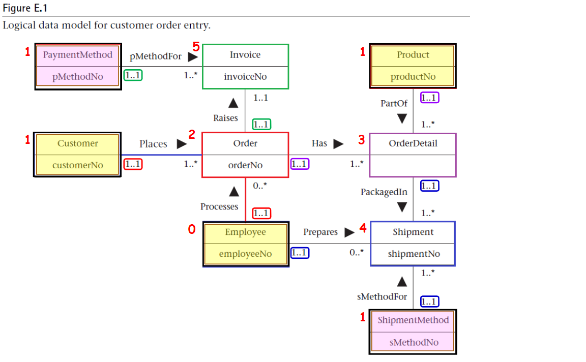
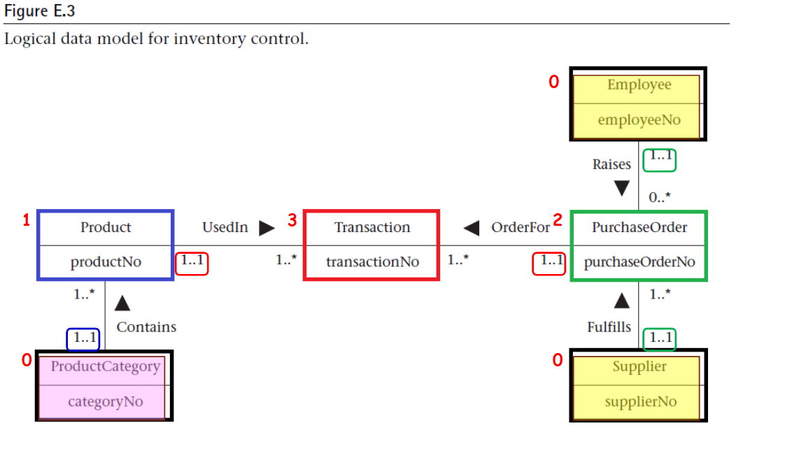

------------------------------------
## 說明

---
### 🧾 訂單 O1001

- 顧客 黃小姐（C001）於 2025-05-01 下單，訂購：
- 無線滑鼠（P001）x2
- 鍵盤（P002）x1
- 負責員工：協燦（E001）
- 出貨情況：
- 2025-05-04，無線滑鼠 x2 已由 協燦 使用 超商取貨 出貨（出貨單號：S001）
- 付款方式：現金（PM01），已付款並於 2025-05-02 開立發票 INV001

---

### 🧾 訂單 O1002

- 顧客 黃小姐（C001）於 2025-05-03 下單，訂購：
- 筆記型電腦（P004）x1
- 負責員工：浩城（E002）
- 出貨情況：
  - 尚未出貨
- 付款方式：尚未付款 / 尚未開立發票

---

### 🧾 訂單 O1003

- 顧客 李先生（C002）於 2025-05-02 下單，訂購：
- 顯示器（P003）x1
- 負責員工：協燦（E001）
- 出貨情況：
  - 尚未出貨
- 付款方式：尚未付款 / 尚未開立發票

---

### 🧾 訂單 O1004

- 顧客 李先生（C002）於 2025-05-05 下單，訂購：
- 鍵盤（P002）x2
- 負責員工：承翰（E003）
- 出貨情況：
- 2025-05-07，鍵盤 x2 已由 承翰 使用 宅配 出貨（出貨單號：S002）
- 付款方式：線上支付（PM03），已付款並於 2025-05-06 開立發票 INV002

---

### 🧾 訂單 O1005

- 顧客 李先生（C002）於 2025-05-08 下單，訂購：
- 耳機（P005）x3
- 負責員工：建杰（E004）
- 出貨情況：
  - 尚未出貨
- 付款方式：尚未付款 / 尚未開立發票

---

### 🧾 訂單 O1006

- 顧客 張小姐（C003）於 2025-05-01 下單，訂購：
- 無線滑鼠（P001）x1
- 負責員工：承翰（E003）
- 出貨情況：
  - 尚未出貨
- 付款方式：尚未付款 / 尚未開立發票

---

### 🧾 訂單 O1007

- 顧客 周先生（C004）於 2025-05-04 下單，訂購：
- 顯示器（P003）x2
- 鍵盤（P002）x1
- 負責員工：浩城（E002）
- 出貨情況：
- 2025-05-06，顯示器 x2 已由 浩城 使用 超商取貨 出貨（出貨單號：S003）
- 付款方式：信用卡（PM02），已付款並於 2025-05-05 開立發票 INV003

---

### 🧾 訂單 O1008

- 顧客 周先生（C004）於 2025-05-06 下單，訂購：
- 筆記型電腦（P004）x1
- 負責員工：承翰（E003）
- 出貨情況：
  - 尚未出貨
- 付款方式：尚未付款 / 尚未開立發票

---

### 🧾 訂單 O1009

- 顧客 周先生（C004）於 2025-05-07 下單，訂購：
- 耳機（P005）x2
- 負責員工：協燦（E001）
- 出貨情況：
- 2025-05-08，耳機 x2 已由 協燦 使用 快遞 出貨（出貨單號：S004）
- 付款方式：尚未付款 / 尚未開立發票
---
### 員工資料 (Employee)

| employeeNo   | title   | firstName   | middleName   | lastName   | address   |   workTelExt |   homeTelNo | empEmailAddress   | socialSecurityNumber   | DOB        | position   | sex   |   salary | dateStarted   |
|:-------------|:--------|:------------|:-------------|:-----------|:----------|-------------:|------------:|:------------------|:-----------------------|:-----------|:-----------|:------|---------:|:--------------|
| E001      | 小姐      | 協燦         |              | 宋       | 彰化    |         1001 |   022345678 | 14@company.com   | A123456789             | 
1990-01-01
 | Sales      | F     |    50000 | 2020-01-01    |
| E002      | 先生      | 浩城        |              | 高        | 桃園  |         1002 |   042345678 | 28@company.com  | B223456789             | 
1985-05-02
 | Sales      | M     |    52000 | 2019-03-15    |
| E003      | 先生      | 承翰       |              | 張        | 台中 |         1003 |   072345678 | 30@company.com  | C323456789             | 
1992-07-12
 | Logistics  | M     |    48000 | 2021-06-01    |
| E004      | 先生     | 建杰       |              | 郭         | 桃園    |         1004 |   062345678 | 32@company.com | D423456789             | 
1988-08-20
 | Manager    | M     |    60000 | 2018-09-10    |

### 顧客資料 (Customer)

| customerNo   | customerName   | customerStreet   | customerCity   | customerState   |   customerZipCode |   custTelNo |   custFaxNo | DOB        | maritalStatus   | creditRating   |
|:-------------|:---------------|:-----------------|:---------------|:----------------|------------------:|------------:|------------:|:-----------|:----------------|:---------------|
| C001         | 黃小姐         | 中山北路         | 台北           | 台北市          |               100 |  0912345678 |  0223456789 | 1995-01-01 | Single          | A              |
| C002         | 李先生         | 自由路           | 台中           | 台中市          |               400 |  0987654321 |  0423456789 | 1980-03-15 | Married         | B              |
| C003         | 張小姐         | 中正路           | 高雄           | 高雄市          |               800 |  0933123456 |  0733456789 | 1992-06-20 | Single          | A              |
| C004         | 周先生         | 民生路           | 台南           | 台南市          |               700 |  0922123456 |  0633456789 | 1978-11-05 | Married         | C              |

### 產品資料 (Product)

| productNo   | productName   | serialNo   |   unitPrice |   quantityOnHand |   reorderLevel |   reorderQuantity |   reorderLeadTime |
|:------------|:--------------|:-----------|------------:|-----------------:|---------------:|------------------:|------------------:|
| P001        | 無線滑鼠      | MOU123     |         300 |              100 |             10 |                50 |                 3 |
| P002        | 鍵盤          | KEY456     |         500 |               80 |             15 |                40 |                 2 |
| P003        | 螢幕          | MON789     |        4000 |               60 |              5 |                20 |                 5 |
| P004        | 筆記型電腦    | LAP321     |       20000 |               40 |              8 |                10 |                 7 |
| P005        | 耳機          | EAR654     |         800 |              120 |             20 |                60 |                 4 |

### 付款方式 (PaymentMethod)

| pMethodNo   | paymentMethod   |
|:------------|:----------------|
| PM01        | 現金            |
| PM02        | 信用卡          |
| PM03        | 線上支付        |

### 出貨方式 (ShipmentMethod)

| sMethodNo   | shipmentMethod   |
|:------------|:-----------------|
| SM01        | 超商取貨         |
| SM02        | 宅配             |
| SM03        | 快遞             |

### 訂單資料 (Order)

| orderNo   | orderDate   | billingStreet   | billingCity   | billingState   |   billingZipCode | promisedDate   | status   | customerNo   | employeeNo   |
|:----------|:------------|:----------------|:--------------|:---------------|-----------------:|:---------------|:---------|:-------------|:-------------|
| O1001     | 2025-05-01  | 中山北路        | 台北          | 台北市         |              100 | 2025-05-05     | 已出貨   | C001         | E001         |
| O1002     | 2025-05-03  | 中山北路        | 台北          | 台北市         |              100 | 2025-05-07     | 處理中   | C001         | E002         |
| O1003     | 2025-05-02  | 自由路          | 台中          | 台中市         |              400 | 2025-05-06     | 已出貨   | C002         | E001         |
| O1004     | 2025-05-05  | 自由路          | 台中          | 台中市         |              400 | 2025-05-09     | 已出貨   | C002         | E003         |
| O1005     | 2025-05-08  | 自由路          | 台中          | 台中市         |              400 | 2025-05-11     | 處理中   | C002         | E004         |
| O1006     | 2025-05-01  | 中正路          | 高雄          | 高雄市         |              800 | 2025-05-05     | 已出貨   | C003         | E003         |
| O1007     | 2025-05-04  | 民生路          | 台南          | 台南市         |              700 | 2025-05-08     | 已出貨   | C004         | E002         |
| O1008     | 2025-05-06  | 民生路          | 台南          | 台南市         |              700 | 2025-05-10     | 處理中   | C004         | E003         |
| O1009     | 2025-05-07  | 民生路          | 台南          | 台南市         |              700 | 2025-05-11     | 處理中   | C004         | E001         |

### 訂單明細 (OrderDetail)

| orderNo   | productNo   |   quantityOrdered |
|:----------|:------------|------------------:|
| O1001     | P001        |                 2 |
| O1001     | P002        |                 1 |
| O1002     | P004        |                 1 |
| O1003     | P003        |                 1 |
| O1004     | P002        |                 2 |
| O1005     | P005        |                 3 |
| O1006     | P001        |                 1 |
| O1007     | P003        |                 2 |
| O1007     | P002        |                 1 |
| O1008     | P004        |                 1 |
| O1009     | P005        |                 2 |

### 發票資料 (Invoice)

| invoiceNo   | dateRaised   | datePaid   |     creditCardNo | holdersName     | expiryDate   | orderNo   | pMethodNo   |
|:------------|:-------------|:-----------|-----------------:|:----------------|:-------------|:----------|:------------|
| INV001      | 2025-05-02   | 2025-05-03 | 4111222233334444 | Huang Xiao Jie  | 2028-12-31   | O1001     | PM01        |
| INV002      | 2025-05-06   | 2025-05-06 | 5555666677778888 | Li Xian Sheng   | 2027-11-30   | O1004     | PM03        |
| INV003      | 2025-05-05   | 2025-05-05 | 9999000011112222 | Zhou Xian Sheng | 2029-01-15   | O1007     | PM02        |

### 出貨資料 (Shipment)

| shipmentNo   |   quantity | shipmentDate   | completeStatus   | orderNo   | productNo   | employeeNo   | sMethodNo   |
|:-------------|-----------:|:---------------|:-----------------|:----------|:------------|:-------------|:------------|
| S001         |          2 | 2025-05-04     | 已完成           | O1001     | P001        | E001         | SM01        |
| S002         |          2 | 2025-05-07     | 已完成           | O1004     | P002        | E003         | SM02        |
| S003         |          2 | 2025-05-06     | 已完成           | O1007     | P003        | E002         | SM01        |
| S004         |          2 | 2025-05-08     | 處理中           | O1009     | P005        | E001         | SM03        |
---

---
### 📦 採購單 PO001

- 採購內容：滑鼠與鍵盤補貨
- 採購日期：2025-04-01，預計到貨日：2025-04-10，實際出貨日：2025-04-05
- 供應商：台灣科技供應商
- 經辦員工：協燦
- 運費：NT$200
- 商品明細：
- 無線滑鼠（電腦周邊）x50，實收 50，報廢 0
- 鍵盤（電腦周邊）x40，實收 38，報廢 2

---

### 📦 採購單 PO002

- 採購內容：顯示器進貨
- 採購日期：2025-04-03，預計到貨日：2025-04-12，實際出貨日：2025-04-07
- 供應商：宏展電子
- 經辦員工：浩城
- 運費：NT$300
- 商品明細：
- 顯示器（顯示設備）x20，實收 20，報廢 0
---

### 員工資料 (Employee)

| employeeNo   | title   | firstName   | middleName   | lastName   | address   |   workTelExt |   homeTelNo | empEmailAddress   | socialSecurityNumber   | DOB        | position   | sex   |   salary | dateStarted   |
|:-------------|:--------|:------------|:-------------|:-----------|:----------|-------------:|------------:|:------------------|:-----------------------|:-----------|:-----------|:------|---------:|:--------------|
| E001      | 小姐      | 協燦         |              | 宋       | 彰化    |         1001 |   022345678 | 14@company.com   | A123456789             | 
1990-01-01
 | Sales      | F     |    50000 | 2020-01-01    |
| E002      | 先生      | 浩城        |              | 高        | 桃園  |         1002 |   042345678 | 28@company.com  | B223456789             | 
1985-05-02
 | Sales      | M     |    52000 | 2019-03-15    |
| E003      | 先生      | 承翰       |              | 張        | 台中 |         1003 |   072345678 | 30@company.com  | C323456789             | 
1992-07-12
 | Logistics  | M     |    48000 | 2021-06-01    |
| E004      | 先生     | 建杰       |              | 郭         | 桃園    |         1004 |   062345678 | 32@company.com | D423456789             | 
1988-08-20
 | Manager    | M     |    60000 | 2018-09-10    |

### 產品分類 (ProductCategory)

| categoryNo   | categoryDescription   |
|:-------------|:----------------------|
| CAT01        | 電腦周邊              |
| CAT02        | 顯示設備              |
| CAT03        | 儲存裝置              |

### 供應商 (Supplier)

| supplierNo   | supplierName   | supplierStreet   | supplierCity   | supplierState   |   supplierZipCode |   suppTelNo |   suppFaxNo | suppEmailAddress   | suppWebAddress    | contactName   |   contactTelNo |   contactFaxNo | contactEmailAddress   | paymentTerms   |
|:-------------|:---------------|:-----------------|:---------------|:----------------|------------------:|------------:|------------:|:-------------------|:------------------|:--------------|---------------:|---------------:|:----------------------|:---------------|
| SUP001       | 台灣科技供應商 | 科技路100號      | 新竹           | 新竹市          |               300 |   035555555 |   035556666 | sales@twtech.com   | http://twtech.com | 王經理        |     0911222333 |      035557777 | manager@twtech.com    | 30天內付款     |
| SUP002       | 宏展電子       | 中山路200號      | 台中           | 台中市          |               400 |   042222222 |   042223333 | service@hz.com     | http://hz.com     | 李主任        |     0922333444 |      042224444 | contact@hz.com        | 月結           |

### 產品資料 (Product)

| productNo   | productName   | serialNo   |   unitPrice |   quantityOnHand |   reorderLevel |   reorderQuantity |   reorderLeadTime | categoryNo   |
|:------------|:--------------|:-----------|------------:|-----------------:|---------------:|------------------:|------------------:|:-------------|
| P001        | 無線滑鼠      | MOU123     |         300 |              100 |             10 |                50 |                 3 | CAT01        |
| P002        | 鍵盤          | KEY456     |         500 |               80 |             15 |                40 |                 2 | CAT01        |
| P003        | 螢幕        | MON789     |        4000 |               60 |              5 |                20 |                 5 | CAT02        |
| P004        | 外接硬碟      | HDD321     |        2500 |               40 |              8 |                10 |                 7 | CAT03        |
| P005        | 耳機          | EAR654     |         800 |              120 |             20 |                60 |                 4 | CAT01        |

### 採購單 (PurchaseOrder)

| purchaseOrderNo   | purchaseOrderDescription   | orderDate   | dateRequired   | shippedDate   |   freightCharge | supplierNo   | employeeNo   |
|:------------------|:---------------------------|:------------|:---------------|:--------------|----------------:|:-------------|:-------------|
| PO001             | 滑鼠與鍵盤補貨             | 2025-04-01  | 2025-04-10     | 2025-04-05    |             200 | SUP001       | E001         |
| PO002             | 螢幕進貨                 | 2025-04-03  | 2025-04-12     | 2025-04-07    |             300 | SUP002       | E002         |

### 交易紀錄 (Transaction)

| transactionNo   | transactionDate   | transactionDescription   |   unitPrice |   unitsOrdered |   unitsReceived |   unitsSold |   unitsWastage | productNo   | purchaseOrderNo   |
|:----------------|:------------------|:-------------------------|------------:|---------------:|----------------:|------------:|---------------:|:------------|:------------------|
| T001            | 2025-04-06        | 滑鼠到貨                 |         300 |             50 |              50 |           0 |              0 | P001        | PO001             |
| T002            | 2025-04-06        | 鍵盤到貨                 |         500 |             40 |              38 |           0 |              2 | P002        | PO001             |
| T003            | 2025-04-08        | 螢幕到貨               |        4000 |             20 |              20 |           0 |              0 | P003        | PO002             |
